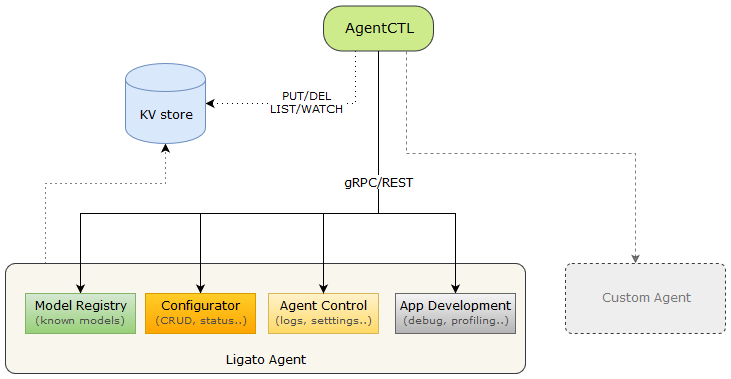

# Agentctl

---

## Introduction

Agenctl is a CLI command line tool for managing and interacting with the software components of the Ligato framework. 
It provides a simple and intuitive CLI that enables the developer or operator to perform the following:

- Manage VPP agent configurations 
- Inspect and generate models
- List, get, put and delete operations against a KV data store
- Check status
- Manage services
- Configure logs
- Gather stats
- Perform system dumps   



---

## Installation

### Docker Image Pull

Agentctl is included in the official docker images for the VPP agent. The [Quickstart Guide](quickstart.md) covers the steps, in detail, from initial image pull to agentctl command execution. 

For convenience, here are the commands for image pull, start etcd, start VPP agent, and agentctl help. 

Pull the VPP agent image from dockerhub:
```
docker pull ligato/vpp-agent
```
Start etcd:
```
docker run --rm --name etcd -p 2379:2379 -e ETCDCTL_API=3 quay.io/coreos/etcd /usr/local/bin/etcd -advertise-client-urls http://0.0.0.0:2379 -listen-client-urls http://0.0.0.0:2379
```
Start VPP Agent:
```
docker run -it --rm --name vpp-agent -p 5002:5002 -p 9191:9191 --privileged ligato/vpp-agent
``` 
Agentctl help to get started:
```
docker exec -it vpp-agent agentctl --help
```
---


### Build from Source

A local image can be built from the [VPP agent repository][ligato-vpp-agent-repo]. Follow the [Local Image Build](get-vpp-agent.md#local-image-build) instructions contained in the VPP Agent Setup section of the User Guide. 

Start the VPP agent:
```
vpp-agent
```

Agentctl help:
```
agentctl --help
```

---

## Setup

Run Agentctl:
```
agentctl
```
Output:
```json

                      __      __  __
  ___ ____ ____ ___  / /_____/ /_/ /
 / _ '/ _ '/ -_) _ \/ __/ __/ __/ /
 \_,_/\_, /\__/_//_/\__/\__/\__/_/
     /___/

COMMANDS
  config      Manage agent configuration
  dump        Dump running state
  generate    Generate config samples
  import      Import config data from file
  kvdb        Manage agent data in KVDB
  log         Manage agent logging
  metrics     Get runtime metrics
  model       Manage known models
  service     Manage agent services
  status      Retrieve agent status and version info
  values      Retrieve values from scheduler
  vpp         Manage VPP instance

OPTIONS:
      --config-dir string        Path to directory with config file.
  -D, --debug                    Enable debug mode
  -e, --etcd-endpoints strings   Etcd endpoints to connect to, default from ETCD_ENDPOINTS env var (default
                                 [127.0.0.1:2379])
      --grpc-port int            gRPC server port (default 9111)
  -H, --host string              Address on which agent is reachable, default from AGENT_HOST env var
                                 (default "127.0.0.1")
      --http-basic-auth string   Basic auth for HTTP connection in form "user:pass"
      --http-port int            HTTP server port (default 9191)
      --insecure-tls             Use TLS without server's certificate validation
  -l, --log-level string         Set the logging level ("debug"|"info"|"warn"|"error"|"fatal")
      --service-label string     Service label for specific agent instance, default from MICROSERVICE_LABEL
                                 env var
  -v, --version                  Print version info and quit

Run 'agentctl COMMAND --help' for more information on a command.
```
!!! note
    Bears worth repeating: Use `agentctl <ANY COMMAND> --help` for explanations and in some cases, examples for any of the agentctl commands and subcommands. 

---

### NB Access Methods

Agentctl currently uses various NB access methods provided by the Ligato agents. The default values can be modified as needed.

- Agent host instance running on `127.0.0.1` by default
    * use option `-H`/`--host` or env var `AGENT_HOST` to change this
    * this is used for both gRPC and REST access
- gRPC running on port `9111` by default
    * use option `--grpc-port` to change this
- REST running on port `9191` by default
    * use option `--http-port` to change this
- etcd datastore used by the agent on `127.0.0.1:2379 `by default 
    * use option `--etcd-endpoints` or env var `ETCD_ENDPOINTS` to change this

---

## Commands

Agentctl subcommands:

- [config](#config)
- [dump](#dump)
- [generate](#generate)
- [import](#import)
- [kvdb](#kvdb)
- [log](#log)
- [metrics](#metrics)
- [model](#model)
- [service](#service)
- [status](#status)
- [values](#values)
- [vpp](#vpp)

---

### Config

Use this command to manage VPP agent configuration data.

```
Usage:	agentctl config COMMAND

Manage agent configuration

COMMANDS
  get         Get config from agent
  history     Retrieve config history
  resync      Run config resync
  retrieve    Retrieve currently running config
  update      Update config in agent
```

---

**Config get:**
```sh
agentctl config get
```
Sample output:
```json
vppConfig:
  interfaces:
  - name: loop1
    type: SOFTWARE_LOOPBACK
    enabled: true
    ipAddresses:
    - 192.168.1.1/24
  bridgeDomains:
  - name: bd1
    forward: true
    learn: true
    interfaces:
    - name: loop1
linuxConfig: {}
netallocConfig: {}
```

---

**Config history:**
```json
agentctl config history
```
Sample output:
```golang
  SEQ     TYPE                          AGE  SUMMARY                   RESULT
    0  ⟱  NB Transaction   Full Resync  16m  values: 16 -> 0 executed  ok
    1  ⟱  NB Transaction                14m  values:  1 -> 4 executed  ok
    2  ⇧  SB Notification               14m  values:  1 -> 1 executed  ok
    3  ⟱  NB Transaction                13m  values:  1 -> 2 executed  ok
    4  ⟱  NB Transaction   SB Sync      7m   values:  0 -> 0 executed  ok
```

---

**Config [resync](../developer-guide/kvscheduler.md#resync):**
```
agentctl config resync
```
Sample output:
```json
{
  "Start": "2020-04-01T23:28:21.3068686Z",
  "Stop": "2020-04-01T23:28:21.5081483Z",
  "SeqNum": 2,
  "TxnType": "NBTransaction",
  "ResyncType": "DownstreamResync"
}
```

---

**Config retrieve** (a running config)
```sh
agentctl config retrieve
```
Sample output:
```json
dump:
  vppConfig:
    interfaces:
    - name: UNTAGGED-local0
      type: SOFTWARE_LOOPBACK
      physAddress: 00:00:00:00:00:00
    - name: loop1
      type: SOFTWARE_LOOPBACK
      enabled: true
      physAddress: de:ad:00:00:00:00
      ipAddresses:
      - 192.168.1.1/24
    bridgeDomains:
    - name: bd1
      forward: true
      learn: true
      interfaces:
      - name: loop1
    routes:
    - type: DROP
      dstNetwork: ::/0
      nextHopAddr: ::
      weight: 1
    - dstNetwork: fe80::/10
      nextHopAddr: ::
      weight: 1
    - type: DROP
      dstNetwork: 0.0.0.0/0
      nextHopAddr: 0.0.0.0
      weight: 1
    - type: DROP
      dstNetwork: 240.0.0.0/4
      nextHopAddr: 0.0.0.0
      weight: 1
    - type: DROP
      dstNetwork: 224.0.0.0/4
      nextHopAddr: 0.0.0.0
      weight: 1
    - dstNetwork: 192.168.1.1/24
      nextHopAddr: 0.0.0.0
      outgoingInterface: loop1
      weight: 1
    - dstNetwork: 192.168.1.1/32
      nextHopAddr: 192.168.1.1
      outgoingInterface: loop1
      weight: 1
    - type: DROP
      dstNetwork: 0.0.0.0/32
      nextHopAddr: 0.0.0.0
      weight: 1
    - type: DROP
      dstNetwork: 255.255.255.255/32
      nextHopAddr: 0.0.0.0
      weight: 1
    - type: DROP
      dstNetwork: 192.168.1.255/32
      nextHopAddr: 0.0.0.0
      weight: 1
    - type: DROP
      dstNetwork: 192.168.1.0/32
      nextHopAddr: 0.0.0.0
      weight: 1
    nat44Global: {}
  linuxConfig: {}
  netallocConfig: {}
```

---

**Config update**

Example of an existing config:
```json
vppConfig:
  interfaces:
  - name: loop1
    type: SOFTWARE_LOOPBACK
    enabled: true
    ipAddresses:
    - 192.168.1.1/24
  bridgeDomains:
  - name: bd1
    forward: true
    learn: true
    interfaces:
    - name: loop1
linuxConfig: {}
netallocConfig: {}
```
We want to update the existing config with a new `loop2` interface. This is saved in a file called `update.txt`
```json
vppConfig:
  interfaces:
  - name: loop2
    type: SOFTWARE_LOOPBACK
    enabled: true
    ipAddresses:
    - 192.168.3.1/24
```

Run the config update command:
```json
agentctl config update ./update.txt
```

Updated config now contains the `loop2` interface config item:
```json
vppConfig:
  interfaces:
  - name: loop1
    type: SOFTWARE_LOOPBACK
    enabled: true
    ipAddresses:
    - 192.168.1.1/24
  - name: loop2
    type: SOFTWARE_LOOPBACK
    enabled: true
    ipAddresses:
    - 192.168.3.1/24
  bridgeDomains:
  - name: bd1
    forward: true
    learn: true
    interfaces:
    - name: loop1
linuxConfig: {}
netallocConfig: {}
```

Use the `replace` flag to swap the existing config with a new config contained in `update.txt`:
```json
agentctl config update --replace ./update.txt
```

---

### Dump

Use this command to dump the running state from the KV Scheduler.

```
Usage:	agentctl dump MODEL

Dump running state

EXAMPLES

 To dump all data:
  $ agentctl dump all

 To dump all VPP data in json format run:
  $ agentctl dump -f json vpp.*

 To use different dump view use --view flag:
  $ agentctl dump --view=NB vpp.interfaces

OPTIONS:
  -f, --format string   Format output
      --view string     Dump view type: cached, NB, SB (default "cached")
```


**Dump all:**
```
agentctl dump all
```

Sample Output:
```
+----------------------+---------+-----------------------------------+----------------------+-----------------------------------------+
|        MODEL         | ORIGIN  |               VALUE               |       METADATA       |                   KEY                   |
+----------------------+---------+-----------------------------------+----------------------+-----------------------------------------+
| vpp.ipfix.ipfix      | from-SB | # ligato.vpp.ipfix.IPFIX          |                      | config/vpp/ipfix/v2/ipfix               |
|                      |         | collector:                        |                      |                                         |
|                      |         |   address: 0.0.0.0                |                      |                                         |
|                      |         | sourceAddress: 0.0.0.0            |                      |                                         |
|                      |         | vrfId: 4294967295                 |                      |                                         |
|                      |         |                                   |                      |                                         |
+----------------------+         +-----------------------------------+----------------------+-----------------------------------------+
| vpp.nat.nat44-global |         | # ligato.vpp.nat.Nat44Global      |                      | config/vpp/nat/v2/nat44-global          |
|                      |         | {}                                |                      |                                         |
|                      |         |                                   |                      |                                         |
+----------------------+         +-----------------------------------+----------------------+-----------------------------------------+
| vpp.interfaces       |         | # ligato.vpp.interfaces.Interface | DevType: local       | UNTAGGED-local0                         |
|                      |         | name: UNTAGGED-local0             | IPAddresses: null    |                                         |
|                      |         | type: SOFTWARE_LOOPBACK           | InternalName: local0 |                                         |
|                      |         | physAddress: 00:00:00:00:00:00    | SwIfIndex: 0         |                                         |
|                      |         |                                   | TAPHostIfName: ""    |                                         |
|                      |         |                                   | Vrf: 0               |                                         |
|                      |         |                                   |                      |                                         |
+                      +---------+-----------------------------------+----------------------+-----------------------------------------+
|                      | from-NB | # ligato.vpp.interfaces.Interface | DevType: ""          | loop1                                   |
|                      |         | name: loop1                       | IPAddresses:         |                                         |
|                      |         | type: SOFTWARE_LOOPBACK           | - 192.168.1.1/24     |                                         |
|                      |         | enabled: true                     | InternalName: ""     |                                         |
|                      |         | ipAddresses:                      | SwIfIndex: 1         |                                         |
|                      |         | - 192.168.1.1/24                  | TAPHostIfName: ""    |                                         |
|                      |         |                                   | Vrf: 0               |                                         |
|                      |         |                                   |                      |                                         |
+----------------------+---------+-----------------------------------+----------------------+-----------------------------------------+
| vpp.proxyarp-global  | from-SB | # ligato.vpp.l3.ProxyARP          |                      | config/vpp/v2/proxyarp-global           |
|                      |         | {}                                |                      |                                         |
|                      |         |                                   |                      |                                         |
+----------------------+         +-----------------------------------+----------------------+-----------------------------------------+
| vpp.route            |         | # ligato.vpp.l3.Route             |                      | vrf/0/dst/0.0.0.0/0/gw/0.0.0.0          |
|                      |         | type: DROP                        |                      |                                         |
|                      |         | dstNetwork: 0.0.0.0/0             |                      |                                         |
|                      |         | nextHopAddr: 0.0.0.0              |                      |                                         |
|                      |         | weight: 1                         |                      |                                         |
|                      |         |                                   |                      |                                         |
+                      +         +-----------------------------------+----------------------+-----------------------------------------+
|                      |         | # ligato.vpp.l3.Route             |                      | vrf/0/dst/0.0.0.0/32/gw/0.0.0.0         |
|                      |         | type: DROP                        |                      |                                         |
|                      |         | dstNetwork: 0.0.0.0/32            |                      |                                         |
|                      |         | nextHopAddr: 0.0.0.0              |                      |                                         |
|                      |         | weight: 1                         |                      |                                         |
|                      |         |                                   |                      |                                         |
+                      +         +-----------------------------------+----------------------+-----------------------------------------+
|                      |         | # ligato.vpp.l3.Route             |                      | vrf/0/dst/224.0.0.0/4/gw/0.0.0.0        |
|                      |         | type: DROP                        |                      |                                         |
|                      |         | dstNetwork: 224.0.0.0/4           |                      |                                         |
|                      |         | nextHopAddr: 0.0.0.0              |                      |                                         |
|                      |         | weight: 1                         |                      |                                         |
|                      |         |                                   |                      |                                         |
+                      +         +-----------------------------------+----------------------+-----------------------------------------+
|                      |         | # ligato.vpp.l3.Route             |                      | vrf/0/dst/240.0.0.0/4/gw/0.0.0.0        |
|                      |         | type: DROP                        |                      |                                         |
|                      |         | dstNetwork: 240.0.0.0/4           |                      |                                         |
|                      |         | nextHopAddr: 0.0.0.0              |                      |                                         |
|                      |         | weight: 1                         |                      |                                         |
|                      |         |                                   |                      |                                         |
+                      +         +-----------------------------------+----------------------+-----------------------------------------+
|                      |         | # ligato.vpp.l3.Route             |                      | vrf/0/dst/255.255.255.255/32/gw/0.0.0.0 |
|                      |         | type: DROP                        |                      |                                         |
|                      |         | dstNetwork: 255.255.255.255/32    |                      |                                         |
|                      |         | nextHopAddr: 0.0.0.0              |                      |                                         |
|                      |         | weight: 1                         |                      |                                         |
|                      |         |                                   |                      |                                         |
+                      +         +-----------------------------------+----------------------+-----------------------------------------+
|                      |         | # ligato.vpp.l3.Route             |                      | vrf/0/dst/::/0/gw/::                    |
|                      |         | type: DROP                        |                      |                                         |
|                      |         | dstNetwork: ::/0                  |                      |                                         |
|                      |         | nextHopAddr: ::                   |                      |                                         |
|                      |         | weight: 1                         |                      |                                         |
|                      |         |                                   |                      |                                         |
+                      +         +-----------------------------------+----------------------+-----------------------------------------+
|                      |         | # ligato.vpp.l3.Route             |                      | vrf/0/dst/fe80::/10/gw/::               |
|                      |         | dstNetwork: fe80::/10             |                      |                                         |
|                      |         | nextHopAddr: ::                   |                      |                                         |
|                      |         | weight: 1                         |                      |                                         |
|                      |         |                                   |                      |                                         |
+----------------------+         +-----------------------------------+----------------------+-----------------------------------------+
| vpp.vrf-table        |         | # ligato.vpp.l3.VrfTable          | Index: 0             | id/0/protocol/IPV4                      |
|                      |         | label: ipv4-VRF:0                 | Protocol: 0          |                                         |
|                      |         |                                   |                      |                                         |
+                      +         +-----------------------------------+----------------------+-----------------------------------------+
|                      |         | # ligato.vpp.l3.VrfTable          | Index: 0             | id/0/protocol/IPV6                      |
|                      |         | protocol: IPV6                    | Protocol: 1          |                                         |
|                      |         | label: ipv6-VRF:0                 |                      |                                         |
|                      |         |                                   |                      |                                         |
+----------------------+---------+-----------------------------------+----------------------+-----------------------------------------+


```

---

**Dump the `vpp.interfaces` model:**
```
agentctl dump vpp.interfaces
```
Sample Output:
```
+----------------+---------+-----------------------------------+----------------------+-----------------+
|     MODEL      | ORIGIN  |               VALUE               |       METADATA       |       KEY       |
+----------------+---------+-----------------------------------+----------------------+-----------------+
| vpp.interfaces | from-SB | # ligato.vpp.interfaces.Interface | DevType: local       | UNTAGGED-local0 |
|                |         | name: UNTAGGED-local0             | IPAddresses: null    |                 |
|                |         | type: SOFTWARE_LOOPBACK           | InternalName: local0 |                 |
|                |         | physAddress: 00:00:00:00:00:00    | SwIfIndex: 0         |                 |
|                |         |                                   | TAPHostIfName: ""    |                 |
|                |         |                                   | Vrf: 0               |                 |
|                |         |                                   |                      |                 |
+                +---------+-----------------------------------+----------------------+-----------------+
|                | from-NB | # ligato.vpp.interfaces.Interface | DevType: Loopback    | loop1           |
|                |         | name: loop1                       | IPAddresses:         |                 |
|                |         | type: SOFTWARE_LOOPBACK           | - 192.168.1.1/24     |                 |
|                |         | enabled: true                     | InternalName: loop0  |                 |
|                |         | ipAddresses:                      | SwIfIndex: 1         |                 |
|                |         | - 192.168.1.1/24                  | TAPHostIfName: ""    |                 |
|                |         |                                   | Vrf: 0               |                 |
|                |         |                                   |                      |                 |
+----------------+---------+-----------------------------------+----------------------+-----------------+
```

---

**Dump the `vpp.interfaces` model using a NB view:**
```
agentctl dump --view=NB vpp.interfaces
```
Sample Output:
```
+----------------+---------+-----------------------------------+---------------------+-------+
|     MODEL      | ORIGIN  |               VALUE               |      METADATA       |  KEY  |
+----------------+---------+-----------------------------------+---------------------+-------+
| vpp.interfaces | from-NB | # ligato.vpp.interfaces.Interface | DevType: Loopback   | loop1 |
|                |         | name: loop1                       | IPAddresses:        |       |
|                |         | type: SOFTWARE_LOOPBACK           | - 192.168.1.1/24    |       |
|                |         | enabled: true                     | InternalName: loop0 |       |
|                |         | ipAddresses:                      | SwIfIndex: 1        |       |
|                |         | - 192.168.1.1/24                  | TAPHostIfName: ""   |       |
|                |         |                                   | Vrf: 0              |       |
|                |         |                                   |                     |       |
+----------------+---------+-----------------------------------+---------------------+-------+
```

---

Dump the `vpp.interfaces` model using json format:

```
agentctl dump -f json vpp.interfaces
```
Sample Output:
```json
[
  {
    "Key": "config/vpp/v2/interfaces/UNTAGGED-local0",
    "Value": {
      "name": "UNTAGGED-local0",
      "type": "SOFTWARE_LOOPBACK",
      "physAddress": "00:00:00:00:00:00"
    },
    "Metadata": {
      "IPAddresses": null,
      "SwIfIndex": 0,
      "TAPHostIfName": "",
      "Vrf": 0
    },
    "Origin": 2
  },
  {
    "Key": "config/vpp/v2/interfaces/loop1",
    "Value": {
      "name": "loop1",
      "type": "SOFTWARE_LOOPBACK",
      "enabled": true,
      "ipAddresses": [
        "192.168.1.1/24"
      ]
    },
    "Metadata": {
      "IPAddresses": [
        "192.168.1.1/24"
      ],
      "SwIfIndex": 1,
      "TAPHostIfName": "",
      "Vrf": 0
    },
    "Origin": 1
  }
]
```

---

### Model

Use this command to gather information about models.

```
Usage:	agentctl model [options] COMMAND

Manage known models

COMMANDS
  inspect     Display detailed information on one or more models
  ls          List models
```

**List all supported models:**
```
agentctl model ls
```
Sample Output:
```
MODEL                       CLASS    PROTO MESSAGE                            KEY PREFIX
govppmux.stats              metrics  ligato.govppmux.Metrics                  metrics/govppmux/v0/stats
linux.interfaces.interface  config   ligato.linux.interfaces.Interface        config/linux/interfaces/v2/interface/
linux.iptables.rulechain    config   ligato.linux.iptables.RuleChain          config/linux/iptables/v2/rulechain/
linux.l3.arp                config   ligato.linux.l3.ARPEntry                 config/linux/l3/v2/arp/
linux.l3.route              config   ligato.linux.l3.Route                    config/linux/l3/v2/route/
netalloc.ip                 config   ligato.netalloc.IPAllocation             config/netalloc/v1/ip/
vpp.abfs.abf                config   ligato.vpp.abf.ABF                       config/vpp/abfs/v2/abf/
vpp.acls.acl                config   ligato.vpp.acl.ACL                       config/vpp/acls/v2/acl/
vpp.arp                     config   ligato.vpp.l3.ARPEntry                   config/vpp/v2/arp/
vpp.dhcp-proxy              config   ligato.vpp.l3.DHCPProxy                  config/vpp/v2/dhcp-proxy/
vpp.exception               config   ligato.vpp.punt.Exception                config/vpp/v2/exception/
vpp.interfaces              config   ligato.vpp.interfaces.Interface          config/vpp/v2/interfaces/
vpp.ipredirect              config   ligato.vpp.punt.IPRedirect               config/vpp/v2/ipredirect/
vpp.ipscanneigh-global      config   ligato.vpp.l3.IPScanNeighbor             config/vpp/v2/ipscanneigh-global
vpp.ipsec.sa                config   ligato.vpp.ipsec.SecurityAssociation     config/vpp/ipsec/v2/sa/
vpp.ipsec.spd               config   ligato.vpp.ipsec.SecurityPolicyDatabase  config/vpp/ipsec/v2/spd/
vpp.ipsec.tun-protect       config   ligato.vpp.ipsec.TunnelProtection        config/vpp/ipsec/v2/tun-protect/
vpp.l2.bridge-domain        config   ligato.vpp.l2.BridgeDomain               config/vpp/l2/v2/bridge-domain/
vpp.l2.fib                  config   ligato.vpp.l2.FIBEntry                   config/vpp/l2/v2/fib/
vpp.l2.xconnect             config   ligato.vpp.l2.XConnectPair               config/vpp/l2/v2/xconnect/
vpp.l3xconnect              config   ligato.vpp.l3.L3XConnect                 config/vpp/v2/l3xconnect/
vpp.nat.dnat44              config   ligato.vpp.nat.DNat44                    config/vpp/nat/v2/dnat44/
vpp.nat.nat44-global        config   ligato.vpp.nat.Nat44Global               config/vpp/nat/v2/nat44-global
vpp.nat.nat44-interface     config   ligato.vpp.nat.Nat44Interface            config/vpp/nat/v2/nat44-interface/
vpp.nat.nat44-pool          config   ligato.vpp.nat.Nat44AddressPool          config/vpp/nat/v2/nat44-pool/
vpp.proxyarp-global         config   ligato.vpp.l3.ProxyARP                   config/vpp/v2/proxyarp-global
vpp.route                   config   ligato.vpp.l3.Route                      config/vpp/v2/route/
vpp.span                    config   ligato.vpp.interfaces.Span               config/vpp/v2/span/
vpp.srv6.localsid           config   ligato.vpp.srv6.LocalSID                 config/vpp/srv6/v2/localsid/
vpp.srv6.policy             config   ligato.vpp.srv6.Policy                   config/vpp/srv6/v2/policy/
vpp.srv6.srv6-global        config   ligato.vpp.srv6.SRv6Global               config/vpp/srv6/v2/srv6-global
vpp.srv6.steering           config   ligato.vpp.srv6.Steering                 config/vpp/srv6/v2/steering/
vpp.stn.rule                config   ligato.vpp.stn.Rule                      config/vpp/stn/v2/rule/
vpp.tohost                  config   ligato.vpp.punt.ToHost                   config/vpp/v2/tohost/
vpp.vrf-table               config   ligato.vpp.l3.VrfTable                   config/vpp/v2/vrf-table/                   
```

---

Show details about a specific model using `vpp.interfaces` as an example:
```
agentctl model inspect vpp.interfaces
```
Sample Output:
```
[
  {
    "Name": "vpp.interfaces",
    "Class": "config",
    "Module": "vpp",
    "Type": "interfaces",
    "Version": "v2",
    "KeyPrefix": "config/vpp/v2/interfaces/",
    "NameTemplate": "{{.Name}}",
    "ProtoName": "ligato.vpp.interfaces.Interface",
    "ProtoFile": "ligato/vpp/interfaces/interface.proto",
    "GoType": "*vpp_interfaces.Interface",
    "PkgPath": "go.ligato.io/vpp-agent/v3/proto/ligato/vpp/interfaces"
  }
]
```
---

### Status

Use this command to return VPP agent status, version, build and plugin info. 

```
Usage:	agentctl status

Retrieve agent status

OPTIONS:
  -f, --format string   Format output
```

**Status command**
```
agentctl status
```
Sample Output:
```
AGENT
    App name:    vpp-agent
    Version:     v3.2.0-alpha-22-ge9aa3556d

    State:       OK
    Started:     2020-07-03 15:10:51 +0000 UTC (22m36s ago)
    Last change: 22m30s
    Last update: 3s

    Go version:  go1.14.4
    OS/Arch:     linux/amd64

    Build Info:
        Git commit: e9aa3556defe818904670e3f5051246fdd11746d
        Git branch: HEAD
        User:       root
        Host:       06a7eb7fd825
        Built:      2020-07-03 13:01:58 +0000 UTC

PLUGINS
    VPPAgent: OK
    etcd: OK
    govpp: OK
    vpp-abfplugin: INIT
    vpp-aclplugin: INIT
    vpp-ifplugin: OK
    vpp-ipsec-plugin: INIT
    vpp-l2plugin: INIT
    vpp-l3plugin: INIT
    vpp-natplugin: INIT
    vpp-srplugin: INIT


```

---

### Values

Use this command to retrieve the key-value pairs and derived keys from the KV scheduler.

```
Usage:	agentctl values [MODEL]

Retrieve values from scheduler

OPTIONS:
  -f, --format string   Format output

```
**Values command:**
```
agentctl values
```

Sample Output:
```
MODEL                  NAME                                                STATE        DETAILS   LAST OP   ERROR
vpp.l2.bridge-domain   bd1                                                 CONFIGURED             CREATE
                       vpp/bd/bd1/interface/loop1                          CONFIGURED             CREATE
vpp.nat.nat44-global                                                       obtained
vpp.interfaces         UNTAGGED-local0                                     obtained
vpp.interfaces         loop1                                               CONFIGURED             CREATE
                       vpp/interface/loop1/address/static/192.168.1.1/24   CONFIGURED             CREATE
                       vpp/interface/loop1/has-IP-address                  CONFIGURED             CREATE
                       vpp/interface/loop1/vrf/0/ip-version/v4             CONFIGURED             CREATE
vpp.proxyarp-global                                                        obtained
vpp.route              vrf/0/dst/0.0.0.0/0/gw/0.0.0.0                      obtained
vpp.route              vrf/0/dst/0.0.0.0/32/gw/0.0.0.0                     obtained
vpp.route              vrf/0/dst/224.0.0.0/4/gw/0.0.0.0                    obtained
vpp.route              vrf/0/dst/240.0.0.0/4/gw/0.0.0.0                    obtained
vpp.route              vrf/0/dst/255.255.255.255/32/gw/0.0.0.0             obtained
vpp.route              vrf/0/dst/::/0/gw/::                                obtained
vpp.route              vrf/0/dst/fe80::/10/gw/::                           obtained
vpp.vrf-table          id/0/protocol/IPV4                                  obtained
vpp.vrf-table          id/0/protocol/IPV6                                  obtained
                       linux/interface/host-name/eth0                      obtained
                       linux/interface/host-name/lo                        obtained
                       vpp/interface/UNTAGGED-local0/link-state/DOWN       obtained
                       vpp/interface/loop1/link-state/UP                   obtained
```

---

### KVDB

Use this command to perform get, put, del or list operations against the KV data store. It is similar to etcdctl, but supports short form [keys][keys], 
which requires setting the `--service-label` flag in the specific command.

```
Usage:	agentctl kvdb [options] COMMAND

Manage agent data in KVDB

ALIASES
  kvdb, kv

COMMANDS
  del         Delete key-value entry
  get         Get key-value entry
  list        List key-value entries
  put         Put key-value entry
```
!!! Note
    Attempts to interact with the etcd data store using the `agentctl kvdb` command could encounter a `Failed to connect to Etcd` message. This is because the VPP agent that includes `agentctl` is started in one container, and etcd is started another. Agentctl uses a default address of `127.0.0.1` to reach the etcd server; The etcd server is started with a default address of `172.17.0.2:2379`. The solution is to pass the etcd server address to agentctl using the `e` or `--etcd-endpoints` flags like so: `agentctl -e 172.17.0.2:2379 kvdb <command>`.

---

**kvdb list:**
```json
agentctl kvdb list
```
Sample Output:
```json
/vnf-agent/vpp1/check/status/v1/agent
{"build_version":"v3.2.0-alpha-1-g615f9fd36","build_date":"Wed Mar 18 17:59:27 UTC 2020","state":"OK","start_time":"1586275960","last_change":"1586275967","last_update":"1586280942","commit_hash":"615f9fd","plugins":[{"name":"govpp","state":"OK"},{"name":"VPPAgent","state":"OK"},{"name":"etcd","state":"OK"},{"name":"vpp-ifplugin","state":"OK"}]}
/vnf-agent/vpp1/check/status/v1/plugin/VPPAgent
{"state":"OK","last_change":"1586275962","last_update":"1586280942"}
...
```
Depending on the number of entries in the KV data store, the output could be massive and difficult to read. 
You can whittle this down by using a more specific key.

---

For example, use this command to list only the configured interfaces:
```json
agentctl kvdb list /vnf-agent/vpp1/config/vpp/v2/interfaces/ 
``` 
Sample output:
```json
/vnf-agent/vpp1/config/vpp/v2/interfaces/loop1
{"name":"loop1","type":"SOFTWARE_LOOPBACK","enabled":true,"ip_addresses":["192.168.1.1/24"]}
/vnf-agent/vpp1/config/vpp/v2/interfaces/tap
{“name”:”tap1”,”type”:”TAP”,”enabled”:true,”ip_addresses”:[“192.168.1.1/24”]}
```

---

**kvdb put** example using a loopback interface
```json
agentctl kvdb put /vnf-agent/vpp1/config/vpp/v2/interfaces/loop1 '{"name":"loop1","type":"SOFTWARE_LOOPBACK","enabled":true,"ip_addresses":["192.168.1.1/24"]}'
```
Response is `OK`.

---

**kvdb get** example for the loopback interface using the long form key:
```
agentctl kvdb get /vnf-agent/vpp1/config/vpp/v2/interfaces/loop1
```
Sample output:
```json
{"name":"loop1","type":"SOFTWARE_LOOPBACK","enabled":true,"ip_addresses":["192.168.1.1/24"]}

---

```
**kvdb delete** example for the loopback interface using the long form key:
```
agentctl kvdb del /vnf-agent/vpp1/config/vpp/v2/interfaces/loop1
```
Response is `OK`

Attempting to `get` the deleted entry will result in a `key not found` message. 


---

### VPP

Use this command to manage the connected VPP instance. The CLI option saves time for the developer or operator by avoiding the need to "jump to" the actual VPP command line interface. 

```
Usage:	agentctl vpp [options] COMMAND

Manage VPP instance

COMMANDS
  cli         Execute VPP CLI command
  info        Retrieve info about VPP
```
Example using the `CLI` option to run the VPP `show version` command:
```
agentctl vpp cli show version
```
Sample output:
```
vpp# show version
vpp v20.01-rc2~11-gfce396738~b17 built by root on b81dced13911 at 2020-01-29T21:07:15
```

---

Use the `info` option to show VPP information:
```
agentctl vpp info
```
Sample Output:
```
VERSION:
Version:                  v20.01-rc2~11-gfce396738~b17
Compiled by:              root
Compile host:             b81dced13911
Compile date:             2020-01-29T21:07:15
Compile location:         /w/workspace/vpp-merge-2001-ubuntu1804
Compiler:                 GCC 8.3.0
Current PID:              15

CONFIG:
Command line arguments:
  /usr/bin/vpp
  unix
    {
    nodaemon
    cli-listen
    0.0.0.0:5002
    cli-no-pager
    }
  plugins
    {
    plugin
    dpdk_plugin.so
      {
      disable
      }
    }
  socksvr
    {
    default
    }
  statseg
    {
    default
    per-node-counters
    on
    }
```

---

### Import

Use this command to import configuration data from an external file using etcd or gRPC.  


```
Usage:	agentctl import file

Import config data from file

EXAMPLES

 To import file contents into Etcd, run:
  $ cat input.txt
  config/vpp/v2/interfaces/loop1 {"name":"loop1","type":"SOFTWARE_LOOPBACK"}
  config/vpp/l2/v2/bridge-domain/bd1 {"name":"bd1"}

  $ agentctl import input.txt

 To import it via gRPC, include --grpc flag:
  $ agentctl import --grpc=localhost:9111 input.txt

 FILE FORMAT
    Contents of the import file must contain single key-value pair per line:

    <key1> <value1>
    <key2> <value2>
    ...
    <keyN> <valueN>

    Empty lines and lines starting with '#' are ignored.

 KEY FORMAT
    Keys can be defined in two ways:

    - full: 	/vnf-agent/vpp1/config/vpp/v2/interfaces/iface1
    - short:	config/vpp/v2/interfaces/iface1

    For short keys, the import command uses microservice label defined with --service-label.

OPTIONS:
      --grpc         Enable to import config via gRPC
  -t, --time uint    Timeout (in seconds) to wait for server response (default 30)
      --txops uint   Number of ops per transaction (default 128)

```

---

Here is another example using short form keys with the microservice label. The contents of the `myconfig` configuration data file are:
```
config/vpp/v2/interfaces/loop1 {"name":"loop1","type":"SOFTWARE_LOOPBACK"}
config/vpp/v2/interfaces/loop2 {"name":"loop2","type":"MEMIF"}
config/vpp/l2/v2/bridge-domain/bd1 {"name":"bd1","interfaces":[{"name":"loop1"},{"name":"loop2"}]}
```

Import command:
```
agentctl --service-label=agent1 import ./myconfig
```
Results:
```
importing 3 key vals
 - /vnf-agent/agent1/config/vpp/v2/interfaces/loop1
 - /vnf-agent/agent1/config/vpp/v2/interfaces/loop2
 - /vnf-agent/agent1/config/vpp/l2/v2/bridge-domain/bd1
commiting tx with 3 ops
```

---

### Generate

Use this command to generate a configuration sample for a model.


```
Usage:	agentctl generate MODEL

Generate config samples

ALIASES
  generate, gen

OPTIONS:
  -f, --format string   Output formats: json, yaml (default "json")
      --oneline         Print output as single line (only json format)
```

---

Generate a configuration sample for a VPP route:

```
agentctl generate vpp.route
```

Sample Output:
```
{
  "type": "INTRA_VRF",
  "vrf_id": 0,
  "dst_network": "",
  "next_hop_addr": "",
  "outgoing_interface": "",
  "weight": 0,
  "preference": 0,
  "via_vrf_id": 0
}
```

---

### Log


Use this command to manage the log levels for all loggers in the system.

```
Usage:	agentctl log [options] COMMAND

Manage agent logging

COMMANDS
  list        List agent loggers
  set         Set agent logger level

```

List current loggers and their log levels:
```
agentctl log list
```

Example of setting the KV Scheduler log level to `debug`:
```
agentctl log set kvscheduler debug
```
Result:
```
logger kvscheduler has been set to level debug
```

---

### Service

Use this command to manage services.

```
Usage:	agentctl service [options] COMMAND

Manage agent services

COMMANDS
  call        Call methods on services
  list        List remote services
```

---

List remote services including `methods` using the `-m` flag:
```
agentctl service list -m
```
Sample output:
```
service ligato.configurator.ConfiguratorService (ligato/configurator/configurator.proto)
 - rpc Get (GetRequest) returns (GetResponse)
 - rpc Update (UpdateRequest) returns (UpdateResponse)
 - rpc Delete (DeleteRequest) returns (DeleteResponse)
 - rpc Dump (DumpRequest) returns (DumpResponse)
 - rpc Notify (NotifyRequest) returns (stream NotifyResponse)

service ligato.configurator.StatsPollerService (ligato/configurator/statspoller.proto)
 - rpc PollStats (PollStatsRequest) returns (stream PollStatsResponse)

service ligato.generic.ManagerService (ligato/generic/manager.proto)
 - rpc SetConfig (SetConfigRequest) returns (SetConfigResponse)
 - rpc GetConfig (GetConfigRequest) returns (GetConfigResponse)
 - rpc DumpState (DumpStateRequest) returns (DumpStateResponse)
 - rpc Subscribe (SubscribeRequest) returns (stream SubscribeResponse)

service ligato.generic.MetaService (ligato/generic/meta.proto)
 - rpc KnownModels (KnownModelsRequest) returns (KnownModelsResponse)
```
---

Call service and method:
```
agentctl service call SERVICE METHOD
```

### Metrics

Use this command to collect and view run-time metrics.
```
Usage:	agentctl metrics [options] COMMAND

Get runtime metrics

COMMANDS
  get         Get metrics data
  list        List metrics
```

---

List metrics:
```
agentctl metrics list
```
Sample output:
```
METRIC          PROTO MESSAGE
govppmux.stats  ligato.govppmux.Metrics
```
---

Get metrics:
```
agentctl metrics get govppmux.stats
```
Sample Output:
```json
{
  "channels_created": 35,
  "channels_open": 35,
  "request_replies": 41,
  "requests_done": 78,
  "requests_sent": 78
}
```

---

[ligato-vpp-agent-repo]: https://github.com/ligato/vpp-agent
[keys]: ../user-guide/concepts.md#keys