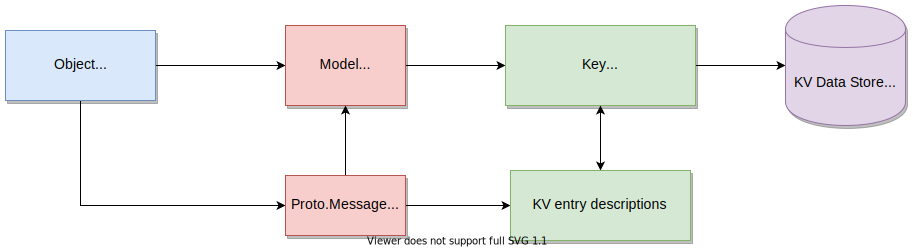

# Concepts

This section describes several important concepts of the vpp-agent and cn-infra.

---

## What is a Model?

The model represents an abstraction of an object that can be managed through northbound APIs exposed by the vpp-agent. The model is used to generate a complete `key` associated with a value for the object stored in a KV data store.


### Model Components

- model spec
- protobuf message (`proto.Message`)
- name template (optional)

### Model Specification

The model specification (spec) describes the model using the module, version and type fields:

- `module` -  groups models belonging to the same configuration entity. For example, VPP configuration models have a VPP module; Linux configuration models have a Linux module.
- `version` - current version of the vpp-agent API. This value changes upon release of a new version.
- `type` - keyword describing the given model (e.g. interfaces, bridge-domains, etc.)

Model specs are defined in the `models.go` files contained in the [VPP agent proto file folder](https://github.com/ligato/vpp-agent/tree/master/proto/ligato).

### Key Prefix

The three fields of the `model spec` are used to form a `key prefix` like so.
```
config/<module>/<version>/<type>/
```

The model spec portion of a model's key prefix can be discerned by inspecting the models.go files.

Alternatively, the output of the [agentctl model](../user-guide/agentctl.md#model) shows the model name and corresponding key prefix.

### Keys

A key is used as an index for an object managed by a CNF or app. For example, there is a key associated with each object stored in a KV data store. Note that this is `NOT` the key associated with a value structured as key-value pairs contained in the KV data store.

The `key prefix` is prepended to a more specific object identifier, such as an index value or name, to form a `key`. There are two types of key formats: short form key and long form key.

The key difference (sorry, could not resist :) between the two is that the latter is prepended by a [microservice-label-prefix](#keys-and-microservice-label). This is identifies a specific instance of a vpp-agent. By default, long form keys are used.

short form key
```
/config/<key prefix>/<identifier>
```


short form key example for a vpp interface
```
/config/vpp/v2/interfaces/<name>
```

long form key
```
/vnf-agent/<microservice label>/config/<key prefix>/<identifier>
```


long form key example for a vpp interface
```
/vnf-agent/vpp1/config/vpp/v2/interfaces/<name>
```

If the object is `read only`, then `/config/` is replaced by `/status/` in the key prefix.

An example of a long form key in action was shown in [section 5.1 of the Quickstart Guide][quickstart-guide-51-keys]. A VPP loopback interface with the value of an IP address is inserted into an etcd KV data store.

```
$ docker exec etcd etcdctl put /vnf-agent/vpp1/config/vpp/v2/interfaces/loop1 \
'{"name":"loop1","type":"SOFTWARE_LOOPBACK","enabled":true,"ip_addresses":["192.168.1.1/24"]}'
``` 
Note that the value of `loop1` is the `<name>` of the interface.

Keys can also be distinguished by the composition of the identifier.

* Composite keys composed of a `key prefix` and `combination of fields`. An example is a [vpp route](https://github.com/ligato/vpp-agent/blob/master/proto/ligato/vpp/l3/models.go)
* Specific keys composed of a `key prefix` and `unique parameter`. An example is an [vpp interface name](https://github.com/ligato/vpp-agent/blob/master/proto/ligato/vpp/interfaces/models.go).
* Global keys composed of a `key prefix` and `some constant string`. Only one message of the given type can be stored under a global key. An example is [Nat44Global](https://github.com/ligato/vpp-agent/blob/master/proto/ligato/vpp/nat/models.go)

### proto.Message

The proto.Message defines the structure and serialized format of the data associated with an object in protobuf format. It serves two purposes in the Ligato framework:

- Describes an object's configuration or metric fields.
- Generates northbound `protobuf APIs` used by applications and components to interact with the configured objects. Agentctl, etcdctl and REST are component examples.

If the object is a route, then the proto.Message contained in the [route.proto](https://github.com/ligato/vpp-agent/blob/master/proto/ligato/vpp/l3/route.proto) file will define destination network, next_hop, outgoing interface and so on.

The combination of the model, and proto.Message are used to define the northbound `protobuf APIs` 



If a new object and API for the CNF is required, the developer need only define the model and .proto file, and then register the model. Ligato will generate a key as part of a northbound API for access to the new object. Logic to process the new object in a new or existing function is required as well.

### Name Templates

Templates enable a developer to generate keys with custom identifiers.

Refer to the [`Custom Templates`](../developer-guide/model-registration.md#custom-templates) section of the Developer Guide for a detailed discussion of name templates.

## Key-Value Data Store

This section describes how the vpp-agent works with a KV data store.

!!! Note
    Terms such as KV database, KVDB, KV store and KV data store are all terms that define a data store or database of key-value (KV) pairs, or more generally, structured data objects. Unless otherwise noted, we will use the term `KV data store` in this documentation. The term `KVDB` will appear in the code examples and this will remain as is.
    
    `Connector` is a plugin providing access or connectivity to an external entity such as a KV data store. The etcd plugin is considered a connector.


The vpp-agent uses an external KV data store for several reasons:
 
 - persist the desired state of the VPP/Linux configuration
 - To store and export certain VPP statistics
 - exploit the `"watch"` paradigm for stateless configuration management. This same approach is employed in other configuration systems such as [confd.](https://confd.io)

### Keys and Microservice Label

!!! Note
    To distinguish between the key prefix and key definitions described above, we will refer to the `/vnf-agent/<microservice label>/` value as the `microservice-label-prefix`

Each vpp-agent is defined with a construct known as the `microservice label`. It is used to group vpp-agents with configuration items stored in the KV data store. vpp-agents configured with the same microservice label will prepend that to a `key prefix` described above to form a `microservice-label-prefix`. These vpp-agents will then watch or listen to configuration item changes indexed by the matching microservice-label-prefix.

In the figure below, vpp-agent 1 on the left with a microservice label = `vpp1` will watch for config changes with the microservice label prefix of `/vnf-agent/vpp1/`. vpp-agent 1 does not care about nor is it watching KV data store config data beginning with `/vnf-agent/vpp2/`.


[](https://www.draw.io/?state=%7B%22ids%22:%5B%221ShslDzO9eDHuiWrbWkxKNRu-1-8w8vFZ%22%5D,%22action%22:%22open%22,%22userId%22:%22109151548687004401479%22%7D#Hligato%2Fdocs%2Fmaster%2Fdocs%2Fimg%2Fuser-guide%2Fkvdb-microservice-label.xml)


The vpp-agent validates microservice-label-prefix and if the label matches, the KV pair is passed to the vpp-agent configuration watchers.

Additionally, if the remainder of long form key is [registered](../developer-guide/model-registration.md), the KV pair is sent to a watcher for processing. Programming the VPP data plane is an example of the processing that can take place.

Flexibility is extended using this architecture.

- single KV data store can support multiple vpp-agent groups using the microservice label.
- vpp-agent can receive config data from multiple sources (e.g. KV data store, gRPC, etc.). An [orchestrator plugin][orchestrator plugin] synchronizes and resolves any conflicts from the individual sources. This presents a "single source" appearance to the vpp-agent plugins.

It should be noted that the vpp-agent _does not require_ a KV data store. Configuration data can be provided using gRPC, potentially REST, AgentCtl and CLI. That said, use of a KV data store to manage and distribute configuration data removes the burden of handling state in the CNFs.

### Supported KV Data Stores

!!! Note
    Some of the items below are technically speaking KV data stores. Some are databases. To avoid acronym overlap and bloat, this section will continue to use the `KV data store` as a uniform term for both.

The vpp-agent provides [connectors to different KV data stores](../plugins/db-plugins.md). All are built on a common abstraction called [kvdbsync][kvdbsync]. The KVDB abstraction approach simplifies the process of changing out one KV data store for another with minimal effort.


Let's have a look at an example:
```go
import (
	"github.com/ligato/cn-infra/db/keyval/etcd"
	// ...
)

func New() *VPPAgent {
	// Prepare KVDB sync plugin with ETCD as a connector
	etcdDataSync := kvdbsync.NewPlugin(kvdbsync.UseKV(&etcd.DefaultPlugin))
	
	// Put the KVDB sync to a list of proto watchers 
	watchers := datasync.KVProtoWatchers{
		etcdDataSync,
	}
	// Provide connection to the orchestrator (or any other plugin)
	orchestrator.DefaultPlugin.Watcher = watchers
	
	// Other plugins
	....
}
```

The code above prepares the kvdbsync plugin with the etcd connector. The kvdbsync plugin serves as a watcher to other plugins, or a writer if passed as the `KVProtoWriters` object. The orchestrator connects to the etcd server.

Let's switch to Redis:
```go
import (
	"github.com/ligato/cn-infra/db/keyval/redis"
	...
)

func New() *VPPAgent {
	// Change KVDB sync plugin to use Redis connector
	redisDataSync := kvdbsync.NewPlugin(kvdbsync.UseKV(&redis.DefaultPlugin))
	
	watchers := datasync.KVProtoWatchers{
		redisDataSync,
	}
	orchestrator.DefaultPlugin.Watcher = watchers
	
	// Other plugins
	....
}
```
 
The orchestrator now connects to a Redis server.

To add support for a new KV data store, one need only write a plugin that can establish a connection to the new data store, and wire it up with the kvdbsync plugin.

### etcd

More information: [etcd documentation][etcd-plugin]

[etcd](https://etcd.io/) is a distributed KV data store that provides data read-write capabilities. The machine hosting the KV data store is referred to as the `etcd server`.

etcd can be started on a local machine in its own container with the following command:
```bash
sudo docker run -p 2379:2379 --name etcd --rm \
    quay.io/coreos/etcd:v3.1.0 /usr/local/bin/etcd \
    -advertise-client-urls http://0.0.0.0:2379 \
    -listen-client-urls http://0.0.0.0:2379
``` 

The vpp-agent `must` start with the kvdbsync plugin using etcd as a connector.
 
!!! Note
 
    There is the example above or you can look over the code [here][datasync-example].

Here is an example of an etcd.conf file defining the IP address and port number of the etcd server.
```
endpoints:
  - "172.17.0.1:2379"
```
The etcd config file is passed to the vpp-agent using the flag `--etcd-confg=<path>`. The file contains additional etcd-specific parameters such as dial timeout, certification and compaction. See the [config files section][list-of-supported] for more details.

Note that if the config file is not provided, the connector plugin will not be started and a connection will not be established. If the etcd server is not reachable, the vpp-agent may not start. [Here](../tutorials/04_kv-store.md#tutorial-etcd-troubleshooting) are several etcd troubleshooting tips.

The recommended tool to manage etcd data is [`etcdctl`][etcdctl].

### Redis

More information: [Redis documentation][redis-plugin]

[Redis](https://redis.io/) is another type of in-memory data store that can function as a database, cache or message broker.

Instructions [here][redis-quickstart] on how to install a `redis-server` on any machine.

The vpp-agent must start with the kvdbsync plugin using Redis as a connector (see code above or look over [this example][datasync-example]). The IP address and port number of the Redis server is defined in the [redis.conf file](http://download.redis.io/redis-stable/redis.conf) and must be provided to the vpp-agent at startup.

The config file is provided to the vpp-agent using the flag `--redis-config=<path>`. Note that if the Redis config file is not provided, the connector plugin will not be started and no connection will be established. If the Redis server is not reachable, the vpp-agent may not start.

The recommended tool to manage a Redis database is the [`redis-cli`][rediscli] tool.

!!! note "Important" 
    The Redis server is by default started with keyspace event notifications disabled. It means, no data change events are forwarded to the watcher. To enable this, use the `config SET notify-keyspace-events KA` command directly in the `redis-cli`, or change the settings in the Redis server startup config.

### Consul

More information: [consul documentation][consul-plugin]

[Consul](https://www.consul.io/) is a service mesh solution providing a full featured control plane with service discovery, configuration, and segmentation functionality. The Consul plugin provides access to a Consul KV data store. The location of the [Consul conf  file](../user-guide/config-files.md#consul) is defined using the `consul-config` flag or set via the `CONSUL_CONFIG` environment variable.

### Bolt
  
[Bolt][bolt] is low-level, simple and fast KV data store for Go implementations. The Bolt plugin provides an API to the Bolt server.

### FileDB

More information: [fileDB documentation][filedb-plugin]

fileDB is unique in that it uses the host OS filesystem as a database. The key-value configuration is stored in text files in a defined path. The fileDB connector works like any other KV data store connector. It reacts on data change events (file edits) in real time and supports all kvdb features including resync, versioning, and microservice labels.

fileDB is not a process, so it does not need to be started. The vpp-agent only requires  correct permissions to access configuration files, and write access if the status is published.

The configuration file format can be `.json` or `.yaml`.

fileDB requires the [conf file](../user-guide/config-files.md#filedb) to load using the `--filedb-config=<path>` flag.

Example config file:

```
configuration-paths: [/path/to/directory/or/file.txt]
```

In this case, absence of the conf file does not prevent the vpp-agent from starting, since the configuration files can be created at a later point.

The configuration file can be edited with a text editor such as `vim`.

### KV Data Store in a Plugin

Implementing a plugin that intends to use a KV data store for publishing or watching begins with the following:

```go 
import (
    "github.com/ligato/cn-infra/datasync"
    ...
}

type Plugin struct {

    ...

    Watcher    datasync.KeyValProtoWatcher 
    Publisher datasync.KeyProtoValWriter    
}        

```

Prepare the connector in the application plugin definition and set it to the example plugin:

```go
func New() *VPPAgent {
	// Prepare KVDB connector writer and watcher
	etcdDataSync := kvdbsync.NewPlugin(kvdbsync.UseKV(&etcd.DefaultPlugin))
	watchers := datasync.KVProtoWatchers{
		etcdDataSync,
	}
	writers := datasync.KVProtoWriters{
        etcdDataSync,
    }
	
	// Pass connector to the plugin:
	plugin.Defaultplugin.Watcher = etcdDataSync
	plugin.Defaultplugin.Publisher = etcdDataSync
	
	...
}
```

**Watcher**

Back in the plugin, start the watcher. The watcher requires two channel types: `datasync.ChangeEvent` and `datasync.ResyncEvent`. It also requires a set of key prefixes to watch.

```go
p.resyncEventChannel := make(chan datasync.ResyncEvent)
p.changeEventChannel := make(chan datasync.ChangeEvent)
keyPrefixes := []string{<prefixes>...}

watchRegistration, err = p.Watcher.Watch("plugin-resync-name", p.resyncEventChannel, p.changeEventChannel, keyPrefixes)
```

Data change and resync events arrive on a particular channel. Next, start the watcher in a new Go routine:

```go
func (p *Plugin) watchEvents() {
	for {
		select {
		case e := <-p.resyncEventChannel:
			// process resync event
        case e := <-p.changeEventChannel:
        	// process data change event
		case <-p.ctx.Done():
			//exit
		}
	}
}
```

It is a good practice to start the event watcher before the watcher registration. 

**Publisher**

The `KeyProtoValWriter` object defines a method, `Put(<key>, <value>, <variadic-options>)`, which allows the KV pair to be saved in the data store. No `Delete()` method is defined. Instead, objects can be removed by sending `null` data with the associated key.

## VPP Configuration Order

Successfully programming the VPP data plane can be a challenge. Dependencies between configuration items exist and there is a strict order of the programming actions that must be adhered to. This manifests itself into two distinct problems to solve:

* A configuration item dependent on any other configuration item cannot be created "in advance". The dependency must be addressed first.
* VPP data plane functions may not behave as desired or fail altogether if a dependency is removed.

### Using VPP CLI

Interfaces are the most common configuration item programmed into VPP. After interface creation, VPP generates an index, which serves as a reference, for other configuration items using an interface. Examples are bridge domains, routes, and ARP entries. Other items, such as FIBs may have more complicated dependencies involving additional configuration items.


To illustrate how this works, start with an empty VPP and configure an interface:
```bash
vpp# create loopback interface 
loop0
vpp# 
```

The interface `loop0` was added and the interface index and name was generated. The index can be shown with the `show interfaces` command.

Set the interface to the `UP` state. The interface name is required.
```bash
vpp# set interface state loop0 up
vpp#
``` 

Now let's create a bridge domain:
```bash
vpp# create bridge-domain 1 learn 1 forward 1 uu-flood 1 flood 1 arp-term 1   
bridge-domain 1
vpp# 
```

The bridge domain is currently empty, so let's assign our interface to it:
```bash
vpp# set interface l2 bridge loop0 1 
vpp#
``` 

We set `loop0` to bridge domain with index 1. Again, we cannot use a non-existing interface because the names are generated at interface creation. We also cannot use a non-existing bridge domain.

Finally, let's configure the FIB table entry:
```bash
vpp# l2fib add 52:54:00:53:18:57 1 loop0
vpp#
```

This command contains dependencies on the `loop0` interface and the bridge domain with ID=1. From the example above, we see that the order of CLI commands must follow this strict sequence: interface, bridge-domain and l2fib.

Now remove the interface:
```bash
vpp# delete loopback interface intfc loop0
vpp#
```

The output of the `show l2fib verbose`command reveals that the interface name was changed from `loop0` to `Stale`.

Remove the bridge domain.
```bash
vpp# create bridge-domain 1 del
vpp#
```

The output of the `show l2fib verbose` is unchanged. This is problematic.
```bash
vpp# sh l2fib verbose
    Mac-Address     BD-Idx If-Idx BSN-ISN Age(min) static filter bvi         Interface-Name        
 52:54:00:53:18:57    1      1      0/0      no      *      -     -               Stale                     
L2FIB total/learned entries: 2/0  Last scan time: 6.6309e-4sec  Learn limit: 4194304 
vpp#
``` 
An attempt to remove the FIB entry is invalid:
```bash
vpp# l2fib del 52:54:00:53:18:57 1 
l2fib del: bridge domain ID 1 invalid
vpp#
```

So we end up with a configuration that cannot be removed until the bridge domain is re-created. To avoid similar scenarios and provide more flexibility in the configuration order, the vpp-agent uses an automatic configuration sequencing mechanism.

### Using the Ligato vpp-agent

The vpp-agent employs a northbound (NB) API definition for every supported configuration item.  NB interface configuration through an API creates the interface, sets its state, MAC address, IP addresses and so on.

The vpp-agent goes further by permiting the configuration of VPP items with non-existent references. Such an item is not really configured, but the vpp-agent "remembers" it and programs VPP when possible. This removes the strict VPP configuration ordering constraint.

!!! note
    This part requires a basic setup to be prepared (vpp-agent + VPP + etcd). The steps to achieve this are covered in the [quick start guide][quickstart-guide].

Let's begin from the end and program the FIB entry into VPP:
```bash
etcdctl put /vnf-agent/vpp1/config/vpp/l2/v2/fib/bd1/mac/62:89:C6:A3:6D:5C '{"phys_address":"62:89:C6:A3:6D:5C","bridge_domain":"bd1","outgoing_interface":"if1","action":"FORWARD"}'
```

Have a look at the vpp-agent output of `planned operations`:
```bash
1. CREATE [NOOP IS-PENDING]:
  - key: config/vpp/l2/v2/fib/bd1/mac/62:89:C6:A3:6D:5C
  - value: { phys_address:"62:89:C6:A3:6D:5C" bridge_domain:"bd1" outgoing_interface:"if1" } 
```

There is one `CREATE` transaction planned: the FIB entry with interface `if1`, and bridge domain `bd1`. None of these exist, so the transaction was postponed. It is flagged as `[NOOP IS-PENDING]`.

Configure the bridge domain:
```bash
etcdctl put /vnf-agent/vpp1/config/vpp/l2/v2/bridge-domain/bd1 '{"name":"bd1","interfaces":[{"name":"if1"}]}'
```

A simple bridge domain with an interface was created. Let's parse the output:
```bash
1. CREATE:
  - key: config/vpp/l2/v2/bridge-domain/bd1
  - value: { name:"bd1" interfaces:<name:"if1" >  } 
2. CREATE [DERIVED NOOP IS-PENDING]:
  - key: vpp/bd/bd1/interface/tap1
  - value: { name:"if1" }
```

Now there are two planned operations: the first is the bridge domain `bd1` which can be created with no restrictions; The second is flagged as: `[DERIVED NOOP IS-PENDING]`. `DERIVED` indicates an internal function performed by the vpp-agent. `[NOOP IS-PENDING` indicates that the interface `if1` is not present yet.

Next step is to add the interface:
```bash
etcdctl put /vnf-agent/vpp1/config/vpp/v2/interfaces/tap1 '{"name":"tap1","type":"TAP","enabled":true}
```

vpp-agent planned operations output shows:
```bash
1. CREATE:
  - key: config/vpp/v2/interfaces/tap1
  - value: { name:"if1" type:TAP enabled:true } 
2. CREATE [DERIVED WAS-PENDING]:
  - key: vpp/bd/bd1/interface/tap1
  - value: { name:"if1" } 
3. CREATE [WAS-PENDING]:
  - key: config/vpp/l2/v2/fib/bd1/mac/62:89:C6:A3:6D:5C
  - value: { phys_address:"62:89:C6:A3:6D:5C" bridge_domain:"bd1" outgoing_interface:"if1" }
```

There are three `planned operations` present. The first one is the interface itself that was created and enabled.

The second operation is marked as `DERIVED` (an internal vpp-agent designation) and `WAS-PENDING` meaning the cached value could be resolved. This operation shows that the interface was added to the bridge domain as defined in the bridge domain configuration.

The last statement is marked `WAS-PENDING` as well and represents the FIB entry that was cached until now. Since the bridge domain and interface dependencies were fulfilled, the FIB was configured.

Now let's try to remove the bridge domain as before:
```bash
etcdctl del /vnf-agent/vpp1/config/vpp/l2/v2/bridge-domain/bd1
```

The output:
```bash
1. DELETE [IS-PENDING]:
  - key: config/vpp/l2/v2/fib/bd1/mac/62:89:C6:A3:6D:5C
  - value: { phys_address:"62:89:C6:A3:6D:5C" bridge_domain:"bd1" outgoing_interface:"if1" } 
2. DELETE [DERIVED]:
  - key: vpp/bd/bd1/interface/tap1
  - value: { name:"if1" } 
3. DELETE:
  - key: config/vpp/l2/v2/bridge-domain/bd1
  - value: { name:"bd1" interfaces:<name:"if1" > } 
```

Observe that the first operation was the removal of the FIB entry. The value was not discarded by the vpp-agent because it still exists in the etcd data store. The vpp-agent returns this value to the cache. The FIB entry no longer exists in VPP and cannot really because the dependencies are not meant. This eliminates the possibility of an accidental mis-configuration or stranding the value in VPP. However, if the bridge domain reappears, the FIB entry will be added back into VPP without any external intervention.

The second step indicates that the interface `if1` was removed from the bridge domain prior to its removal as shown in the last step of the transaction.

The ordering and caching of the configuration data described in this section is performed by the KVScheduler plugin. For more information on how this works, please refer to the discussion of the [KVScheduler][KVs].

## VPP Multi-Version Support

The vpp-agent is highly dependent on the version of the VPP binary API used to send and receive configuration message types. The VPP API is evolving and changing over time, adding new binary calls, or modifying or removing existing ones. The latter is the most crucial from the vpp-agent perspective since it introduces incompatibilities between the vpp-agent and VPP.

For that reason the vpp-agent performs a compatibility check in the GoVPP multiplex plugin. Note that the GoVPP component provides an API for communication with VPP. The compatibility check attempts to read the message ID. If just one message ID is not found per validation in the cyclic redundancy code, VPP is considered incompatible and the vpp-agent will not connect. The message validation is essential for a successful connection.

The vpp-agent is tightly bound to the version of VPP. For that reason, the vpp-agent image is shipped together with a compatible VPP data plane version to safeguard against inconsistencies.

However, the compatibility check function could cause some inconveniences during manual setup. A scenario where the vpp-agent is switched to a different but incompatible version of VPP could induce this situation.

### VPP Compatibility

The vpp-agent bindings are generated from VPP JSON API definitions. Those can be found in the path `/usr/share/vpp/api`. Full VPP installation is a prerequisite if definitions need to be generated. The JSON API definition is then transformed to the `*.ba.go` file using `binapi-generator`, which is a part of the [GoVPP project][govpp-project]. All generated structures implement the GoVPP `Message` interface providing the message name, CRC or message type. This represents the generic type for all messages that can be sent using a VPP channel.

Example:
```go
type CreateLoopback struct {
	MacAddress []byte `struc:"[6]byte"`
}

func (*CreateLoopback) GetMessageName() string {
	return "create_loopback"
}
func (*CreateLoopback) GetCrcString() string {
	return "3b54129c"
}
func (*CreateLoopback) GetMessageType() api.MessageType {
	return api.RequestMessage
}
```

The code above is generated from `create_loopback` within `interface.api.json`. The structure represents the binary API request call. usually this contains a set of fields, which can be set to the required values such as the MAC address of a loopback interface.

Every VPP API request call requires a response:

```go
type CreateLoopbackReply struct {
	Retval    int32
	SwIfIndex uint32
}

func (*CreateLoopbackReply) GetMessageName() string {
	return "create_loopback_reply"
}
func (*CreateLoopbackReply) GetCrcString() string {
	return "fda5941f"
}
func (*CreateLoopbackReply) GetMessageType() api.MessageType {
	return api.ReplyMessage
}
``` 

The response has a `Retval` field, which is `0` if the API call was successful. In an error is returned, the field contains a numerical index of a VPP-defined error message. Other fields can be present with information generated within VPP with the `SwIfIndex` of the created interface above as an example.

Note that the response message has the same name but with a `Reply` suffix. Other types of messages may provide information from VPP. Those API calls have a suffix of `Dump`, and the corresponding reply message contains a `Details` suffix).

If the JSON API was changed, it must be re-generated in the vpp-agent. All changes caused by the modified binary api structures must be resolved (e.g. new or modified data fields). This process can be time consuming as it depends on the size of the detected differences.  

### Multi-Version

In order to minimize updates for various VPP versions, the vpp-agent introduced multi-version support. The vpp-agent can switch to a different VPP version with corresponding APIs without any changes to the vpp-agent itself,  without any need to rebuild the vpp-agent binary. Plugins can now obtain the version of the VPP and the vpp-agent to connect and initialize the correct set of `vppcalls`.

Every `vppcalls` handler registers itself with the VPP version it will support (e.g. `vpp1810`, `vpp1901`, etc.). During initialization, the vpp-agent performs a compatibility check with all available handlers, searching for one that is compatible with the required messages. The chosen handler must be in line with all messages, as it is not possible to use multiple handlers for a single VPP. When the compatibility check locates a workable handler, it is returned to the main plugin.

One small drawback of this solution is code duplication across `vppcalls`. This is a consequence of trivial API changes observed across different versions, which is seen in the majority of cases.

## Client v2

Client v2 defines an API for configuration management of VPP and Linux plugins. How the configuration is transported between APIs and the plugins is fully abstracted from the user.

The API calls can be split into two groups:

- **resync** applies a given (full) configuration. An existing configuration, if present, is replaced. The name is an abbreviation of *resynchronization*. It is applied at initialization, and following any system event resulting in an out-of-sync configuration. Recovering stale configuration options is impossible to determine locally, because for example, connectivity to the data store is temporarily lost.
- **data change** delivers incremental configuration changes.

There are two Client v2 implementations:

- **local client** runs inside the same process as the vpp-agent and delivers configuration data through Go channels directly to the plugins.
- **remote client** stores the configuration data in a data store using the given `keyval.broker`.
   
## Plugin Config Files

Some plugins require external information to ensure proper behavior. An example is the etcd plugin that needs to communicate with an external etcd server to retrieve configuration data. By default, the plugin attempts to connect to a default IP address and port. If connectivity to a different IP address or custom port is desired, this information must be conveyed to the plugin.

For that purpose, the vpp-agent plugins support [conf files][config-files]. A plugin conf file contains plugin-specific fields, which can be modified, to effect changes in plugin behavior.

### Config File Definition

The configuration file is passed to the plugin via vpp-agent flags. The command `vpp-agent -h` displays the list of all plugins supporting static config and can be set using the flag command.

Here is an example using vpp-agent flags to pass an etcd conf file to the plugin:

```bash
vpp-agent -etcd-config=/opt/vpp-agent/dev/etcd.conf
```

Another option is to set the related environment variable:
```bash
export ETCD_CONFIG=/opt/vpp-agent/dev/etcd.conf
```

The conf file conforms to YAML syntax and is un-marshaled to a defined `Config` go structure. All fields are then processed, usually in the plugin `Init()`. It is good practice to always use default values in case the conf file or any of its fields are not provided. This is so the plugin can be successfully started without the conf file.

An example config file (in yaml format):
```bash
db-path: /tmp/bolt.db
file-mode: 0654
```

Every plugin supporting a conf file defines its content as a separate structure. For example, here is the definition of the BoltDB config-file:
```go
type Config struct {
	DbPath      string        `json:"db-path"`
	FileMode    os.FileMode   `json:"file-mode"`
	LockTimeout time.Duration `json:"lock-timeout"`
}
```

The conf file contains multiple fields of various types together with the JSON struct tag. Lists and maps are also allowed. All fields do not necessarily need to be defined in the file. Empty fields are set to default values, or treated as not set.

The majority of plugins support `.conf` files. However, some plugins cannot be loaded without a `.conf` file even if defined as part of the plugin feature set. Other plugins load `.conf` files as the default value. This makes it easy to use `.conf` files to modify certain plugin behavior.

A list of supported configuration files can be found [here][config-files].

[client-v2]: ../user-guide/concepts.md#client-v2
[config-files]: config-files.md
[consul-plugin]: ../plugins/db-plugins.md#consul-plugin
[datasync-example]: https://github.com/ligato/cn-infra/tree/master/examples/datasync-plugin
[etcd-plugin]: ../plugins/db-plugins.md#etcd-plugin
[filedb-plugin]: ../plugins/db-plugins.md#filedb
[govpp-project]: https://wiki.fd.io/view/GoVPP
[kvdbsync]: https://github.com/ligato/cn-infra/tree/master/datasync/kvdbsync
[list-of-supported]: config-files.md
[redis-plugin]: ../plugins/db-plugins.md#redis
[redis-quickstart]: https://redis.io/topics/quickstart
[telemetry-plugin]: ../plugins/vpp-plugins.md#telemetry
[quickstart-guide]: ../user-guide/quickstart.md
[vpp-keys]: ../user-guide/reference.md#vpp-keys
[quickstart-guide-51-keys]: ../user-guide/quickstart.md#51-configure-the-vpp-dataplane-using-the-vpp-agent
[microservice-label]: ../user-guide/config-files.md#service-label
[orchestrator plugin]: ../plugins/plugin-overview.md#orchestrator
[etcdctl]: https://github.com/etcd-io/etcd/tree/master/etcdctl
[rediscli]: https://redis.io/topics/rediscli
[bolt]: https://github.com/boltdb/bolt
[KVs]: ../developer-guide/kvscheduler.md
[govpp]: ../plugins/

*[ARP]: Address Resolution Protocol
*[CLI]: Command-Line Interface
*[KVDB]: Key-Value Database
*[FIB]: Forwarding Information Base
*[REST]: Representational State Transfer
