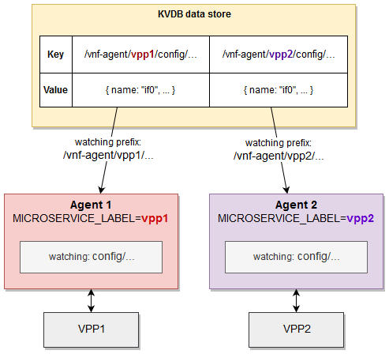

# Concepts

This section describes several concepts that are fundamental to the Ligato VPP agent and Cn-infra architecture and functions.

* Model as a representation of an object managed by the VPP agent
* Key Prefix / Keys for indexing and interacting with configuration objects
* proto.Messages for defining and generating protobuf APIs and keys
* KV data store serving as a repository for configuration information
* KV Scheduler providing a transaction-based system for dependency resolution and configuration management
* KV Descriptors that describe configuration objects for use by the KV Scheduler
* VPP configuration processing as performed by CLI and the KV Scheduler
* Multi-Version support consisting of multiple versions of the VPP dataplane as well as multiple instances of a VPP agent
* Plugin configuration files


---

## What is a Model?

The model represents an abstraction of an object that can be managed through northbound APIs exposed by the VPP agent. The model is used to generate a complete `key` associated with a value for the object stored in a KV data store.


### Model Components

- model spec
- protobuf message (`proto.Message`)
- name template (optional)

---

### Model Specification

The model specification (spec) describes the model using the module, version and type fields:

- `module` -  groups models belonging to the same configuration entity. For example, VPP configuration models identify with a VPP module; Linux configuration models with a Linux module.
- `version` - current version of the VPP agent API. This value changes upon release of a new version.
- `type` - keyword describing the given model such as interfaces or bridge-domains.

Model specs are defined in the `models.go` files located in the [VPP agent proto file folder](https://github.com/ligato/vpp-agent/tree/master/proto/ligato). 

---

### Key Prefix

The three fields of the `model spec` are used to form a `key prefix` like so.
```
config/<module>/<version>/<type>/
```

The [agentctl model commands](../user-guide/agentctl.md#model) return model spec information, key prefix and more in a simple json format.

Agentctl model inspect for the vpp.interfaces model as an example:
```json
agentctl model inspect vpp.interfaces
``` 
Sample output:
```json
[
  {
    "Name": "vpp.interfaces",
    "Class": "config",
    "Module": "vpp",
    "Type": "interfaces",
    "Version": "v2",
    "KeyPrefix": "config/vpp/v2/interfaces/",
    "NameTemplate": "{{.Name}}",
    "ProtoName": "ligato.vpp.interfaces.Interface",
    "ProtoFile": "ligato/vpp/interfaces/interface.proto",
    "GoType": "*vpp_interfaces.Interface",
    "PkgPath": "go.ligato.io/vpp-agent/v3/proto/ligato/vpp/interfaces"
  }
]
```

---

### Keys

A key is used to index and interact with a CNF-managed object stored in a KV data store. Note that this is **not** the key associated with a value structured as key-value pairs contained in the KV data store.

A key is formed by prepending a `key-prefix` to a more specific object identifier, such as an index, name or combination of fields. There are two types of key formats: 

* short form key
* long form key.

A short form key is composed of just a key prefix and object identifier. A long form key is prepended with a [microservice-label-prefix](#keys-and-microservice-label). This prefix contains a label referred to as a microservice label that identifies a specific instance of a VPP agent. Objects sharing the same microservice-label-prefix in their long form keys are managed exclusively by that VPP agent. The use of a microservice-label-prefix is required in environments with multiple VPP agents in operation using the same KV data store.   

short form key:
```
/config/<key prefix>/<identifier>
```


short form key example for a vpp interface called `loop1`:
```
/config/vpp/v2/interfaces/loop1
```

long form key:
```
/vnf-agent/<microservice label>/config/<key prefix>/<identifier>
```


long form key example for a vpp interface:
```
/vnf-agent/vpp1/config/vpp/v2/interfaces/loop1
```

If the object is `read only`, then `/config/` is replaced by `/status/` in the key.

An example of a long form key in action is shown in [section 5 of the Quickstart Guide][quickstart-guide-keys]. A VPP loopback interface configured with an IP address is inserted into an etcd KV data store.

```
$ docker exec etcd etcdctl put /vnf-agent/vpp1/config/vpp/v2/interfaces/loop1 \
'{"name":"loop1","type":"SOFTWARE_LOOPBACK","enabled":true,"ip_addresses":["192.168.1.1/24"]}'
``` 
This example employs a long form VPP interface key with `loop1` as the `<name>` identifier. The microservice label is `vpp1`.

Keys can also be distinguished by the composition of the identifier.

* Composite keys are composed of a `key prefix` and `combination of fields`. Example: [vpp route](https://github.com/ligato/vpp-agent/blob/master/proto/ligato/vpp/l3/models.go).    
* Specific keys are composed of a `key prefix` and `unique parameter`. Example: [vpp interface name](https://github.com/ligato/vpp-agent/blob/master/proto/ligato/vpp/interfaces/models.go).
* Global keys are composed of a `key prefix` and `some constant string`. Only one message of the given type can be stored under a global key. Example: [Nat44Global](https://github.com/ligato/vpp-agent/blob/master/proto/ligato/vpp/nat/models.go).

A list of keys supported by the VPP agent can be found in the [keys reference][key reference] section of the user guide. 

---

### proto.Message

The proto.Message defines the structure and serialized format of the data associated with an object in [protobuf][protobuf] message format. It serves serveral purposes in the Ligato framework:

- Describes an object's name and type fields in a protobuf message format. This simplifies development and documentation readability. 
- Generates northbound `protobuf APIs` used by applications and components to interact with the configured objects. Agentctl, REST and gRPC can all use the generated protobuf APIs.
- Used in conjunction with the model specification to form a key.

If the object is a route, then the proto.Message contained in the [route.proto](https://github.com/ligato/vpp-agent/blob/master/proto/ligato/vpp/l3/route.proto) file will define messages and associated name and type fields. 

A snippet from the route.proto:
```json
message Route {
    enum RouteType {
    }
    RouteType type = 10;
    uint32 vrf_id = 1;
    // Destination nework defined by IP address and prefix (format: <address>/<prefix>).
    string dst_network = 3;

    // Next hop address.
    string next_hop_addr = 4;

    // Interface name of the outgoing interface.
    string outgoing_interface = 5;

    // Weight is used for unequal cost load balancing.
    uint32 weight = 6;

    // Preference defines path preference. Lower preference is preferred.
    // Only paths with the best preference contribute to forwarding (a poor man's primary and backup).
    uint32 preference = 7;

    // Specifies VRF ID for the next hop lookup / recursive lookup
    uint32 via_vrf_id = 8;
}

```
The combination of the model and proto.Message define the northbound `protobuf APIs` exposed to external components and applications. In addition, the model, in conjunction with the proto.Message and model specification, are registered in a model registery. This simplifies access to the model key definitions from other parts of the system such as the KV Scheduler. 


Use the [agentctl model list][agentctl model list] command to print the model names, proto.Message name and the short-form key prefix. For brevity purposes, the vpp.interfaces model is used in this example:
```json
agentctl model ls vpp.interfaces 
```
Sample output:
```json
MODEL NAME      CLASS   PROTO MESSAGE                    KEY PREFIX
vpp.interfaces  config  ligato.vpp.interfaces.Interface  config/vpp/v2/interfaces/
```


---

### Name Templates

Templates enable a developer to generate keys with custom identifiers.

Refer to the [Custom Templates][developer-guide-custom-templates] section of the Developer Guide for a detailed discussion of name templates.

---

## Key-Value Data Store

!!! Note
    KV database, KVDB, KV store and KV data store are terms that define a data store or database of key-value (KV) pairs, or more generally, structured data objects. Unless otherwise noted, we will use the term `KV data store` in the documentation. The term `KVDB` will continue to be used in the agentctl and code examples.
    
    `Connector` is a plugin providing access or connectivity to an external entity such as a KV data store. The etcd plugin is considered a connector.


The VPP agent uses an external KV data store for several reasons:
 
 - persist the desired state of the VPP and Linux configuration because CNFs are stateless.
 - To store and export certain VPP statistics.
 - exploit the `"watch"` paradigm for stateless configuration management. This is a common approach used in other configuration systems such as [confd][confd].
 - Enables asynchronous configuration of resources, even when not running or available.
 - support self configuration on start/restart required in cloud native environments.
 
---

### Keys and Microservice Label

!!! Note
    To distinguish between the key prefix and key definitions described above, we will refer to the `/vnf-agent/<microservice label>/` value as the `microservice-label-prefix`

Each VPP agent is defined with a construct known as the `microservice label`. It is used to group VPP agents with their specific configuration objects stored in the KV data store. VPP agents configured with the same microservice label will prepend that value to a `key prefix` described above to form a `microservice-label-prefix`. VPP agents will then watch or listen to configuration item changes that match their own microservice-label-prefix.

In the figure below, `VPP Agent 1` on the left with a microservice label = `vpp1` will watch for configuration changes to objects with the microservice-label-prefix of `/vnf-agent/vpp1/`. VPP Agent 1 is not concerned with configuration updates beginning with `/vnf-agent/vpp2/` because those are affiliated with `VPP Agent 2` on the right.


[](https://www.draw.io/?state=%7B%22ids%22:%5B%221ShslDzO9eDHuiWrbWkxKNRu-1-8w8vFZ%22%5D,%22action%22:%22open%22,%22userId%22:%22109151548687004401479%22%7D#Hligato%2Fdocs%2Fmaster%2Fdocs%2Fimg%2Fuser-guide%2Fkvdb-microservice-label.xml)


The VPP agent validates the microservice-label-prefix and if the label matches, the KV pair is passed to VPP agent configuration watchers.

Additionally, if the key is [registered](../developer-guide/model-registration.md), the KV pair is sent to a watcher for processing. Programming the VPP data plane is an example of the processing that can take place.

This architecture promotes VPP agent configuration flexibility in the following manner:

- single KV data store can support multiple VPP agent groups by using a unique microservice-label-prefix per group.
- VPP agents can receive configuration data from multiple sources such as a KV data store or gRPC client. An [orchestrator plugin][orchestrator plugin] synchronizes and resolves any conflicts from the individual sources. This presents a "single configuration source" appearance to the VPP agent plugins.

It should be noted that the VPP agent _does not require_ a KV data store. Configuration data can be provided using gRPC, agentCtl, CLI or customized methods. That said, use of a KV data store to manage and distribute configuration data removes the burden of handling state in the CNFs.

---

### Supported KV Data Stores

The VPP agent provides [connectors to different KV data stores](../plugins/db-plugins.md). All are built on a common abstraction called [kvdbsync][kvdbsync]. The approach simplifies the process of changing out one KV data store for another with minimal effort.


Here is an example beginning with the etcd connector:
```go
import (
	"github.com/ligato/cn-infra/db/keyval/etcd"
	// ...
)

func New() *VPPAgent {
	// Prepare KVDB sync plugin with ETCD as a connector
	etcdDataSync := kvdbsync.NewPlugin(kvdbsync.UseKV(&etcd.DefaultPlugin))
	
	// Put the KVDB sync to a list of proto watchers 
	watchers := datasync.KVProtoWatchers{
		etcdDataSync,
	}
	// Provide connection to the orchestrator (or any other plugin)
	orchestrator.DefaultPlugin.Watcher = watchers
	
	// Other plugins
	....
}
```

The code above prepares the kvdbsync plugin with the etcd connector. The kvdbsync plugin serves as a watcher to other plugins, or a writer if passed as the `KVProtoWriters` object. The orchestrator connects to the etcd server.

Now switch to Redis:
```go
import (
	"github.com/ligato/cn-infra/db/keyval/redis"
	...
)

func New() *VPPAgent {
	// Change KVDB sync plugin to use Redis connector
	redisDataSync := kvdbsync.NewPlugin(kvdbsync.UseKV(&redis.DefaultPlugin))
	
	watchers := datasync.KVProtoWatchers{
		redisDataSync,
	}
	orchestrator.DefaultPlugin.Watcher = watchers
	
	// Other plugins
	....
}
```
 
The orchestrator now connects to a Redis server.

To add support for a new KV data store, one need only write a plugin that can establish a connection to the new data store, and wire it up with the kvdbsync plugin.

---

### etcd

More information: [etcd documentation][etcd-plugin]

[etcd](https://etcd.io/) is a distributed KV data store that provides data read-write capabilities. The machine hosting the KV data store is referred to as the `etcd server`. The recommended tool to manage etcd data is [etcdctl][etcdctl]. The VPP agent **must** start with the kvdbsync plugin using etcd as a connector.
 
Here is an example of an etcd.conf file defining the IP address and port number of the etcd server:
```
endpoints:
  - "172.17.0.1:2379"
```
The etcd conf file is passed to the VPP agent using the flag `--etcd-confg=<path>`. The file contains additional etcd-specific parameters such as dial timeout, certification and compaction. See the [config files section][list-of-supported] for more details.

Note that if the conf file is not provided, the connector plugin will not be started and a connection will not be established. If the etcd server is not reachable, the VPP agent may not start. Check out the [etcd troubleshooting tips](../tutorials/04_kv-store.md#tutorial-etcd-troubleshooting) section to assist in resolving these errors. 

---

### Redis

More information: [Redis documentation][redis-plugin]

[Redis](https://redis.io/) is another type of in-memory data store that can function as a database, cache or message broker. The recommended tool to manage a Redis database is the [`redis-cli`][rediscli] tool.

See instructions in the [Redis quickstart documentation][redis-quickstart] on how to install a `redis-server` on any machine.

The VPP agent must start with the kvdbsync plugin using Redis as a connector (see code above or look over [this example][datasync-example]). The IP address and port number of the Redis server is defined in the [redis.conf file](http://download.redis.io/redis-stable/redis.conf) and must be provided to the VPP agent at startup.

The redis conf fileis provided to the VPP agent using the flag `--redis-config=<path>`. Note that if the Redis conf file is not provided, the connector plugin will not be started and the connection will not be established. If the Redis server is not reachable, the VPP agent may not start.

!!! note "Important" 
    By default, the Redis server is by default started with keyspace event notifications disabled. This means, no data change events are forwarded to the watcher. To enable this, use the `config SET notify-keyspace-events KA` command directly in the `redis-cli`, or change the settings in the Redis server startup config.

---

### Consul

More information: [consul documentation][consul-plugin]

[Consul](https://www.consul.io/) is a service mesh solution providing a full featured control plane with service discovery, configuration, and segmentation functionality. The Consul plugin provides access to a Consul KV data store. The location of the [Consul conf  file](../user-guide/config-files.md#consul) is defined using the `consul-config` flag or set via the `CONSUL_CONFIG` environment variable.

---

### Bolt
  
[Bolt][bolt] is low-level, simple and fast KV data store for Go implementations. The Bolt plugin provides an API to the Bolt server.

---

### FileDB

More information: [fileDB documentation][filedb-plugin]

fileDB is unique in that it uses the host OS filesystem as a database. The key-value configuration is stored in text files in a defined path. The fileDB connector works like any other KV data store connector. It reacts on data change events (file edits) in real time and supports all KV data store features including resync, versioning, and microservice labels.

fileDB is not a process, so it does not need to be started. The VPP agent only requires  correct permissions to access configuration files, and write access if the status is published.

The configuration file format can be `.json` or `.yaml`.

fileDB requires the [conf file](../user-guide/config-files.md#filedb) to load using the `--filedb-config=<path>` flag.

Example config file:

```
configuration-paths: [/path/to/directory/or/file.txt]
```

In this case, absence of the conf file does not prevent the VPP agent from starting, since the configuration files can be created at a later point.

The configuration file can be edited with a text editor such as `vim`.

---

### KV Data Store in a Plugin

Implementing a plugin that uses a KV data store for publishing or watching begins with the following:

```go 
import (
    "github.com/ligato/cn-infra/datasync"
    ...
}

type Plugin struct {

    ...

    Watcher    datasync.KeyValProtoWatcher 
    Publisher datasync.KeyProtoValWriter    
}        

```

Prepare the connector in the application plugin definition and set it to the example plugin:

```go
func New() *VPPAgent {
	// Prepare KVDB connector writer and watcher
	etcdDataSync := kvdbsync.NewPlugin(kvdbsync.UseKV(&etcd.DefaultPlugin))
	watchers := datasync.KVProtoWatchers{
		etcdDataSync,
	}
	writers := datasync.KVProtoWriters{
        etcdDataSync,
    }
	
	// Pass connector to the plugin:
	plugin.Defaultplugin.Watcher = etcdDataSync
	plugin.Defaultplugin.Publisher = etcdDataSync
	
	...
}
```

---

**Watcher**

Back in the plugin, start the watcher. The watcher requires two channel types: `datasync.ChangeEvent` and `datasync.ResyncEvent`. It also requires a set of key prefixes to watch.

```go
p.resyncEventChannel := make(chan datasync.ResyncEvent)
p.changeEventChannel := make(chan datasync.ChangeEvent)
keyPrefixes := []string{<prefixes>...}

watchRegistration, err = p.Watcher.Watch("plugin-resync-name", p.resyncEventChannel, p.changeEventChannel, keyPrefixes)
```

Data change and resync events arrive on a particular channel. Next, start the watcher in a new Go routine:

```go
func (p *Plugin) watchEvents() {
	for {
		select {
		case e := <-p.resyncEventChannel:
			// process resync event
        case e := <-p.changeEventChannel:
        	// process data change event
		case <-p.ctx.Done():
			//exit
		}
	}
}
```

It is a good practice to start the event watcher before the watcher registration. 

---

**Publisher**

The `KeyProtoValWriter` object defines a method, `Put(<key>, <value>, <variadic-options>)`, which allows the KV pair to be saved in the data store. No `Delete()` method is defined. Instead, objects can be removed by sending `null` data with the associated key.

---

## KV Scheduler & Descriptors

Successfully programming the VPP data plane can be a challenge. Dependencies between configuration items will exist. There is a strict order of the programming actions, using either CLI or binary API calls, that must be adhered to. This manifests itself into two distinct problems to solve:

* A configuration item dependent on any other configuration item cannot be created "in advance". The dependency must be addressed first.
* VPP data plane functions may not behave as desired, or fail altogether, if a dependency is removed out of order.

The KV Scheduler is a transaction-based system designed to address dependency resolution and programming sequence in the presence of multiple configuration items. It is a core plugin that works with VPP and Linux agents on the southbound side, and orchestrators/external data sources such as KV data stores and RPC clients on the northbound side.  

KV Descriptors are constructs used by the KV Scheduler. They implement CRUD operations, and define derived values and dependencies for configuration item KV pairs. VPP and Linux plugins define descriptors for their own specific configuration items such as interfaces or routes. New KV Descriptors can be added to existing plugins or as part of a custom plugin. KV descriptors are registered with the KV Scheduler so that it may manipulate the KV pairs without needing to understand what they represent. 

Here is a snippet of the VPP route descriptor showing name, key prefix, CRUD callbacks and dependencies:

```json
	typedDescr := &adapter.RouteDescriptor{
		Name:            RouteDescriptorName,
		NBKeyPrefix:     l3.ModelRoute.KeyPrefix(),
		ValueTypeName:   l3.ModelRoute.ProtoName(),
		KeySelector:     l3.ModelRoute.IsKeyValid,
		ValueComparator: ctx.EquivalentRoutes,
		Validate:        ctx.Validate,
		Create:          ctx.Create,
		Delete:          ctx.Delete,
		Retrieve:        ctx.Retrieve,
		Dependencies:    ctx.Dependencies,
		RetrieveDependencies: []string{
			netalloc_descr.IPAllocDescriptorName,
			ifdescriptor.InterfaceDescriptorName,
			VrfTableDescriptorName},
	}
```    

Internally, the KV Scheduler builds a graph to model system state. The vertices represent configuration items. The edges represent relationships (i.e. dependency, derived from) between the configuration items. The KV Scheduler walks the tree to sequence the correct configuration actions. 

It builds a transaction plan that drives CRUD operations to the VPP agent in the southbound direction. Configuration items can be cached until outstanding dependencies are resolved. Partial or full state reconciliation (synchronization) is supported. Information on transaction plans, cached values and errors are exposed via agentctl, logs and REST APIs.

![kvs-system][kvs-system]

Use the scheduler/dump API to print the registered descriptors and key prefixes under watch:
```
curl -X GET http://localhost:9191/scheduler/dump
```
Use [agentctl dump][agentctl dump] commands to print the KV Scheduler's running state:
```json
agentctl dump all
```


## VPP Configuration Order

The best way to illustrate how the VPP agent KV Scheduler handles dependencies is through examples.

* First, use the VPP CLI to configure an interface, bridge domain and L2FIB in that order. Then show what happens when the interface and bridge domain are removed.
* Use agentctl to configure the same information through the VPP agent but in reverse order - L2FIB, bridge domain and interface. Then observe what happens when the bridge interface is removed. 

As will be shown, the VPP agent KV Scheduler is able to choreograph and sequence the series of actions resulting in a successful VPP configuration, even when confronted by multiple dependencies.    

!!! note
    An active VPP, VPP agent and etcd system is required to demonstrate the CLI and VPP agent configuration functions. Follow the steps in the [quick start guide][quickstart-guide] prepare a system. The `agentctl vpp cli` command will be used to interface with the VPP CLI. For the KV Scheduler section, the `agentctl kvdb put/del` will be used to program VPP, and `agentctl config history --format=log` will be used to print the transaction logs.  


---

### Using VPP CLI

Interfaces are the most common configuration item programmed into VPP. After interface creation, VPP generates an index, which serves as a reference, for other configuration items using an interface. Examples are bridge domains, routes, and ARP entries. Other items, such as FIBs may have more complicated dependencies involving additional configuration items.

!!! Note
    If for some reason the agentctl vpp cli commands fail, drop down directly to the VPP CLI console using `docker exec -it vpp-agent vppctl -s localhost:5002`. Then type in the commands but be sure to omit `agentctl vpp cli` prefix.


Start with an empty VPP and configure an interface:
```bash
agentctl vpp cli create loopback interface
```
Output:
```json
loop0
```

The `loop` interface is added. The interface name and index (Idx) are generated. 

Show interfaces:
```
agentctl vpp cli show interface
```
Output:
```json
              Name               Idx    State  MTU (L3/IP4/IP6/MPLS)     Counter          Count
local0                            0     down          0/0/0/0
loop0                             1     down         9000/0/0/0
```

Set the interface to the `UP` state: 
```bash
agentctl vpp cli set interface state loop0 up
``` 

Create a bridge domain:
```bash
agenctl vpp cli create bridge-domain 1 learn 1 forward 1 uu-flood 1 flood 1 arp-term 1
```

The bridge domain is currently empty. Assign the interface to the bridge domain:
```bash
agentctl vpp cli set interface l2 bridge loop0 1 
``` 

The `loop0` interface is set to the bridge domain with an index of 1. It is not possible to use a non-existing interface because the name, `loop0`, is generated at interface creation. The same holds true for a non-existing bridge domain.

Configure the L2FIB table entry:
```bash
agentctl vpp cli l2fib add 52:54:00:53:18:57 1 loop0
```
Show the L2FIB table entry:
```json
agentctl vpp cli show l2fib verbose
```
Output:
```json
    Mac-Address     BD-Idx If-Idx BSN-ISN Age(min) static filter bvi         Interface-Name
 52:54:00:53:18:57    1      1      0/0      no      -      -     -               loop0
```
The `l2fib add` command performed above illustrates the dependencies on the `loop0` interface and the bridge domain with ID=1. The order of CLI commands must follow this sequence: interface, bridge-domain and L2FIB.

---


Now, remove the interface:
```bash
vpp# delete loopback interface intfc loop0
vpp#
```

The output of the `show l2fib verbose`command reveals that the interface name was changed from `loop0` to `Stale`.
```json
    Mac-Address     BD-Idx If-Idx BSN-ISN Age(min) static filter bvi         Interface-Name
 52:54:00:53:18:57    1      1      0/0      no      -      -     -               Stale
```

Remove the bridge domain:
```bash
agentctl vpp cli create bridge-domain 1 del
```

The output of the `show l2fib verbose` command is unchanged. This becomes a problem because attempts to remove the L2FIB dependencies of `bridge domain 1` and interface `loop0` have been performed. 
```bash
vpp# sh l2fib verbose
    Mac-Address     BD-Idx If-Idx BSN-ISN Age(min) static filter bvi         Interface-Name        
 52:54:00:53:18:57    1      1      0/0      no      *      -     -               Stale                     
``` 
An attempt to remove the L2FIB entry is invalid. Note this command was performed from the VPP CLI console:
```bash
l2fib del 52:54:00:53:18:57 1 
```
output:
```json
l2fib del: bridge domain ID 1 invalid
```

The end result is a configuration that cannot be removed until the bridge domain and interface are re-created. 

---

### Using the KV Scheduler

The VPP agent exposes a northbound (NB) API definition for every supported configuration item.  NB interface configuration through an API creates the interface, sets its state, MAC address, IP addresses and so on.

The VPP agent goes further by permitting the configuration of VPP items with non-existent references. Such an item is not configured per se, but rather the KV Scheduler holds on to the information and postpones VPP configuration programming until all dependencies are resolved. This removes the strict VPP configuration ordering constraint.

To illustrate this process, begin by programming the L2FIB entry into VPP:
```bash
agentctl kvdb put /vnf-agent/vpp1/config/vpp/l2/v2/fib/bd1/mac/62:89:C6:A3:6D:5C '{"phys_address":"62:89:C6:A3:6D:5C","bridge_domain":"bd1","outgoing_interface":"if1","action":"FORWARD"}'
```

Log output:
```bash
1. CREATE [NOOP IS-PENDING]:
    - key: config/vpp/l2/v2/fib/bd1/mac/62:89:C6:A3:6D:5C
    - value: { phys_address:"62:89:C6:A3:6D:5C"  bridge_domain:"bd1"  outgoing_interface:"if1" } 
```

There was one `CREATE` operation performed for an L2FIB entry with interface `if1` and bridge domain `bd1`. None of these exist, so the transaction is postponed and flagged as `[NOOP IS-PENDING]`.

Configure the bridge domain:
```json
agenctl kvdb put /vnf-agent/vpp1/config/vpp/l2/v2/bridge-domain/bd1 '{"name":"bd1","interfaces":[{"name":"if1"}]}'
```

A simple bridge domain with an interface `if1` is created. Log output:
```bash
1. CREATE:
    - key: config/vpp/l2/v2/bridge-domain/bd1
    - value: { name:"bd1"  interfaces:{name:"if1"} }
2. CREATE [DERIVED NOOP IS-PENDING]:
    - key: vpp/bd/bd1/interface/if1
    - value: { name:"if1" }
```

There were two operations performed: 

* bridge domain `bd1` is created with no restrictions. 
* interface `if1` is flagged as: `[DERIVED NOOP IS-PENDING]`. `DERIVED` indicates an internal function performed by the VPP agent. `[NOOP IS-PENDING]` indicates that interface `if1` is not present yet.

Confirm that only the bridge domain has been programmed into VPP by running the `agentctl config retrieve` command. Partial output:
```json
vppConfig:
  interfaces:
  - name: UNTAGGED-local0
    type: SOFTWARE_LOOPBACK
    physAddress: 00:00:00:00:00:00
  bridgeDomains:
  - name: bd1
  routes: 
...
```

Next, add the `if` interface:
```bash
agentctl kvdb put /vnf-agent/vpp1/config/vpp/v2/interfaces/if1 '{"name":"if1","type":"SOFTWARE_LOOPBACK","enabled":true}'
```


Log output:
```bash
1. CREATE:
  - key: config/vpp/v2/interfaces/if1
  - value: { name:"if1" type:SOFTWARE_LOOPBACK enabled:true }
2. CREATE [DERIVED WAS-PENDING]:
  - key: vpp/bd/bd1/interface/if1
  - value: { name:"if1" }
3. CREATE [WAS-PENDING]:
  - key: config/vpp/l2/v2/fib/bd1/mac/62:89:C6:A3:6D:5C
  - value: { phys_address:"62:89:C6:A3:6D:5C" bridge_domain:"bd1" outgoing_interface:"if1" }
```

There were three operations performed. The first one is the interface itself that was created and enabled.

The second operation is marked as `DERIVED` (an internal VPP agent designation), and `WAS-PENDING` meaning the cached value can be resolved. This operation shows that the interface was added to the bridge domain as defined in the bridge domain configuration.

The last operation is marked `WAS-PENDING` as well and represents the L2FIB entry that was cached until now. Since the bridge domain and interface dependencies are fulfilled, the L2FIB entry was configured.

Confirm the running configuration with the `agentctl config retrieve` command. Partial output:
```json
vppConfig:
  interfaces:
  ...
  - name: if1
    type: SOFTWARE_LOOPBACK
    enabled: true
    physAddress: de:ad:00:00:00:00
  bridgeDomains:
  - name: bd1
    interfaces:
    - name: if1
  fibs:
  - physAddress: 62:89:c6:a3:6d:5c
    bridgeDomain: bd1
    outgoingInterface: if1
  ...
```

Now remove the bridge domain:
```bash
etcdctl del /vnf-agent/vpp1/config/vpp/l2/v2/bridge-domain/bd1
```

Log output:
```bash
1. DELETE [IS-PENDING]:
  - key: config/vpp/l2/v2/fib/bd1/mac/62:89:C6:A3:6D:5C
  - value: { phys_address:"62:89:C6:A3:6D:5C" bridge_domain:"bd1" outgoing_interface:"if1" }
2. DELETE [DERIVED]:
  - key: vpp/bd/bd1/interface/if1
  - value: { name:"if1" }
3. DELETE:
  - key: config/vpp/l2/v2/bridge-domain/bd1
  - value: { name:"bd1" interfaces:{name:"if1"} } 
```

Observe that the first operation was the removal of the L2FIB entry. The value was not discarded by the VPP agent because it still exists in the etcd data store as confirmed by the `agentctl kvdb list /vnf-agent/vpp1/config/vpp/l2/v2/fib/` command:
```json
/vnf-agent/vpp1/config/vpp/l2/v2/fib/bd1/mac/62:89:C6:A3:6D:5C
{"phys_address":"62:89:C6:A3:6D:5C","bridge_domain":"bd1","outgoing_interface":"if1","action":"FORWARD"}
``` 
The KV Scheduler returns this value to the cache. The L2FIB entry no longer exists in VPP because of unmet dependencies. This eliminates the possibility of an accidental mis-configuration or stranded value in VPP. However, if the bridge domain reappears, the L2FIB entry will be added back into VPP without external intervention.

The second operation indicates that the interface `if1` was removed from the bridge domain prior to the removal of the bridge domain itself as shown in the third operation.

For more information on how this works, refer to the discussion of the [KV Scheduler][KVs] in the developer guide.

---

## VPP Multi-Version Support

The VPP agent is highly dependent on the version of the VPP binary API used to send and receive configuration message types. The VPP API is evolving and changing over time, adding new binary calls, modifying, or removing existing ones. The latter is the most crucial from the VPP agent perspective since it introduces incompatibilities between the VPP agent and VPP.

For that reason the VPP agent performs a compatibility check in the [GoVPP multiplex plugin][govppmux-plugin]. Note that the GoVPP component provides an API for communication with VPP. The compatibility check attempts to read the message ID. If just one message ID is not found per validation in the cyclic redundancy code, VPP is considered incompatible and the VPP agent will not connect. The message validation is essential for a successful connection.

The VPP agent is tightly bound to the version of VPP. For that reason, the VPP agent image is shipped together with a compatible VPP data plane version to safeguard against inconsistencies.

However, the compatibility check function could cause some inconveniences during manual setup. A scenario where the VPP agent is switched to a different but incompatible version of VPP could induce this situation.

---

### VPP Compatibility

The VPP agent bindings are generated from VPP JSON API definitions. Those can be found in the path `/usr/share/vpp/api`. Full VPP installation is a prerequisite if definitions need to be generated. The JSON API definition is then transformed to the `*.ba.go` file using `binapi-generator`, which is a part of the [GoVPP project][govpp-project]. All generated structures implement the GoVPP `Message` interface providing the message name, CRC or message type. This represents the generic type for all messages that can be sent using a VPP channel.

Example:
```go
type CreateLoopback struct {
	MacAddress []byte `struc:"[6]byte"`
}

func (*CreateLoopback) GetMessageName() string {
	return "create_loopback"
}
func (*CreateLoopback) GetCrcString() string {
	return "3b54129c"
}
func (*CreateLoopback) GetMessageType() api.MessageType {
	return api.RequestMessage
}
```

The code above is generated from `create_loopback` within `interface.api.json`. The structure represents the binary API request call. Usually this contains a set of fields, which can be set to the required values such as the MAC address of a loopback interface.

Every VPP API request call requires a response:

```go
type CreateLoopbackReply struct {
	Retval    int32
	SwIfIndex uint32
}

func (*CreateLoopbackReply) GetMessageName() string {
	return "create_loopback_reply"
}
func (*CreateLoopbackReply) GetCrcString() string {
	return "fda5941f"
}
func (*CreateLoopbackReply) GetMessageType() api.MessageType {
	return api.ReplyMessage
}
``` 

The response has a `Retval` field, which is `0` if the API call was successful. In an error is returned, the field contains a numerical index of a VPP-defined error message. Other fields can be present with information generated within VPP with the `SwIfIndex` of the created interface above as an example.

Note that the response message has the same name but with a `Reply` suffix. Other types of messages may provide information from VPP. Those API calls have a suffix of `Dump`, and the corresponding reply message contains a `Details` suffix.

If the JSON API was changed, it must be re-generated in the VPP agent. All changes caused by the modified binary api structures must be resolved (e.g. new or modified data fields). This process can be time consuming as it depends on the size of the detected differences.  

---

### Multi-Version

In order to minimize updates for the various VPP versions, the VPP agent introduced multi-version support. The VPP agent can switch to a different VPP version with the corresponding APIs. There are no changes incurred by the VPP agent, and there is no need to rebuild the VPP agent binary. Plugins can now obtain the version of the VPP and the VPP agent to connect and initialize the correct set of `vppcalls`.

The following figure depicts the version-agnostic and version-specific components used by the VPP (and custom) agents supporting multiple VPP versions. 


Every `vppcalls` handler registers itself with the VPP version it will support (e.g. `vpp1810`, `vpp1901`, etc.). During initialization, the VPP agent performs a compatibility check with all available handlers, searching for one that is compatible with the required messages. The chosen handler must be in line with all messages, as it is not possible to use multiple handlers for a single VPP. When the compatibility check locates a workable handler, it is returned to the main plugin.

One drawback of this solution is some code duplication across `vppcalls`. This is a consequence of trivial API changes observed across different versions, which is seen in the majority of cases.


---

## Client v2

Client v2 defines an API for configuration management of VPP and Linux plugins. How the configuration is transported between APIs and the plugins is fully abstracted from the user.

The API calls can be split into two groups:

- **resync** applies a given (full) configuration. An existing configuration, if present, is replaced. The name is an abbreviation of *resynchronization*. It is applied at initialization, and following any system event resulting in an out-of-sync configuration. Recovering stale configuration options is impossible to determine locally, because for example, connectivity to the data store is temporarily lost.
- **data change** delivers incremental configuration changes.

There are two Client v2 implementations:

- **local client** runs inside the same process as the VPP agent and delivers configuration data through Go channels directly to the plugins.
- **remote client** stores the configuration data in a data store using the given `keyval.broker`.

---
   
## Plugin Conf Files

Some plugins require external information to ensure proper behavior. An example is the etcd plugin that needs to communicate with an external etcd server to retrieve configuration data. By default, the plugin attempts to connect to a default IP address:port. If connectivity to a different IP address:port is desired, this information must be conveyed to the plugin.

For that purpose, VPP agent plugins support [conf files][config-files]. A plugin conf file contains plugin-specific fields, which can be modified, to effect changes in plugin behavior.

### Conf File Definition

The configuration file is passed to the plugin via VPP agent flags. The command `vpp-agent -h` displays the list of all plugins supporting static configuration and can be set using the flag command.

Here is an example using VPP agent flags to pass an etcd conf file to the plugin:

```bash
vpp-agent -etcd-config=/opt/vpp-agent/dev/etcd.conf
```

Another option is to set the related env variable:
```bash
export ETCD_CONFIG=/opt/vpp-agent/dev/etcd.conf
```

The conf file conforms to YAML syntax and is un-marshaled to a defined `Config` go structure. All fields are then processed, usually in the plugin `Init()`. It is good practice to always use default values in case the conf file or any of its fields are not provided. This is so the plugin can be successfully started without the conf file.

An example conf file or the fileDB plugin (in yaml format):
```bash
db-path: /tmp/bolt.db
file-mode: 0654
```

Every plugin supporting a conf file defines its content as a separate structure. For example, here is the Bolt struct definition:
```go
type Config struct {
	DbPath      string        `json:"db-path"`
	FileMode    os.FileMode   `json:"file-mode"`
	LockTimeout time.Duration `json:"lock-timeout"`
}
```

The conf file contains multiple fields of various types together with the JSON struct tag. Lists and maps are also allowed. All fields do not necessarily need to be defined in the file. Empty fields are set to default values, or treated as not set.

The majority of plugins support `.conf` files. However, some plugins cannot be loaded without a `.conf` file even if defined as part of the plugin feature set. Other plugins load `.conf` files as the default value. This makes it easy to use `.conf` files to modify certain plugin behavior.

The [conf files][config-files] section of the user guide discusses plugin configuration files in more detail.


[agentctl model list]: agentctl.md#model
[agentctl dump]: agentctl.md#dump
[client-v2]: ../user-guide/concepts.md#client-v2
[confd]: https://confd.io
[config-files]: config-files.md
[consul-plugin]: ../plugins/db-plugins.md#consul-plugin
[datasync-example]: https://github.com/ligato/cn-infra/tree/master/examples/datasync-plugin
[developer-guide-custom-templates]: ../developer-guide/model-registration.md#custom-templates 
[etcd-plugin]: ../plugins/db-plugins.md#etcd-plugin
[filedb-plugin]: ../plugins/db-plugins.md#filedb
[govppmux-plugin]: ../plugins/vpp-plugins.md#govppmux-plugin
[govpp-project]: https://wiki.fd.io/view/GoVPP
[kvdbsync]: https://github.com/ligato/cn-infra/tree/master/datasync/kvdbsync
[key reference]: reference.md
[kvs-system]: ../img/user-guide/2components-ligato-framework-arch-KVS2.svg
[list-of-supported]: config-files.md
[protobuf]: https://developers.google.com/protocol-buffers
[redis-plugin]: ../plugins/db-plugins.md#redis
[redis-quickstart]: https://redis.io/topics/quickstart
[telemetry-plugin]: ../plugins/vpp-plugins.md#telemetry
[quickstart-guide]: ../user-guide/quickstart.md
[vpp-keys]: ../user-guide/reference.md#vpp-keys
[quickstart-guide-keys]: ../user-guide/quickstart.md#5-managing-the-vpp-agent
[microservice-label]: ../user-guide/config-files.md#service-label
[orchestrator plugin]: ../plugins/plugin-overview.md#orchestrator
[etcdctl]: https://github.com/etcd-io/etcd/tree/master/etcdctl
[rediscli]: https://redis.io/topics/rediscli
[bolt]: https://github.com/boltdb/bolt
[KVs]: ../developer-guide/kvscheduler.md
[govpp]: ../plugins/

*[ARP]: Address Resolution Protocol
*[CLI]: Command-Line Interface
*[KVDB]: Key-Value Database
*[FIB]: Forwarding Information Base
*[REST]: Representational State Transfer
