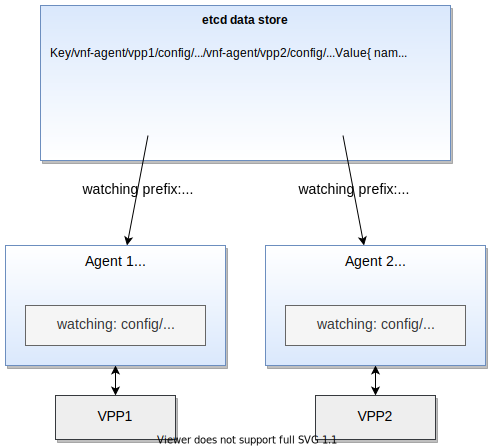

# Concepts

This section describes Ligato concepts.

---

## What is a Model?

The model represents an abstraction of a configuration object. You manage configuration objects through northbound (NB) APIs exposed by your Ligao agent. Ligato uses models to generate a complete __key__ associated with a value for the objec. You can store object key values in a Key Value (KV) data store.

---

### Model Components

- Model spec
- Protobuf message (`proto.Message`)
- Name template (optional)

---

### Model Specification

The model specification (spec) describes the model using the module, version and type fields:

- `module` -  groups models belonging to the same configuration entity. For example, VPP configuration models identify with a VPP module; Linux configuration models with a Linux module.
- `version` - current version of the VPP agent API. This value changes upon release of a new version.
- `type` - keyword describing the given model type such as interfaces or bridge-domains.

Ligato defines model specs in the `models.go` files located in the VPP agent repository [proto folder](https://github.com/ligato/vpp-agent/tree/master/proto/ligato).

---

### Key Prefix

The three fields of the `model spec` form a key prefix:
```
config/<module>/<version>/<type>/
```

The [agentctl model commands](../user-guide/agentctl.md#model) return model spec information, key prefix, and additional information in json format.

Agentctl model inspect for the `vpp.interfaces` model:
```json
agentctl model inspect vpp.interfaces
``` 
Sample output:
```json
[
  {
    "Name": "vpp.interfaces",
    "Class": "config",
    "Module": "vpp",
    "Type": "interfaces",
    "Version": "v2",
    "KeyPrefix": "config/vpp/v2/interfaces/",
    "NameTemplate": "{{.Name}}",
    "ProtoName": "ligato.vpp.interfaces.Interface",
    "ProtoFile": "ligato/vpp/interfaces/interface.proto",
    "GoType": "*vpp_interfaces.Interface",
    "PkgPath": "go.ligato.io/vpp-agent/v3/proto/ligato/vpp/interfaces"
  }
]
```

---

### Keys

A key lets you index and manage object values stored in a KV data store. A key is formed by prepending a key prefix to a more specific object identifier, such as an index, name, or combination of fields. 

There are two types of key formats: 

* Short form key
* Long form key.

A short form key consists of a key prefix and object identifier. 

A long form key prepends a [microservice-label-prefix](#keys-and-microservice-label) to the short form key. This prefix contains a label referred to as a microservice-label. The label identifies the VPP agent associated with key-values prepended with the corresponding microservice-label-prefix.  

---
   
Short form key structure:
```
/config/<key prefix>/<identifier>
```


Short form key example for a VPP interface called `loop1`:
```
/config/vpp/v2/interfaces/loop1
```

Long form key structure:
```
/vnf-agent/<microservice label>/config/<key prefix>/<identifier>
```


Long form key example for the same VPP interface called `loop1`:
```
/vnf-agent/vpp1/config/vpp/v2/interfaces/loop1
```

A read-only object uses `/status/`instead of `/config/` in its key.

---

You can see a long form key in action in [section 5 of the Quickstart Guide][quickstart-guide-keys]. You put your VPP loopback interface configuration into an etcd data store.

```
docker exec etcd etcdctl put /vnf-agent/vpp1/config/vpp/v2/interfaces/loop1 \
'{"name":"loop1","type":"SOFTWARE_LOOPBACK","enabled":true,"ip_addresses":["192.168.1.1/24"]}'
``` 
This example uses a long form VPP interface key with `loop1` as the `<name>` identifier. The microservice-label is `vpp1`.

You can distinguish keys by the composition of the object identifier:

* **Composite keys** - key prefix and combination of fields. Example: [vpp route](https://github.com/ligato/vpp-agent/blob/master/proto/ligato/vpp/l3/models.go).
<br></br>    
* **Specific keys** -  key prefix and unique parameter. Example: [vpp interface name](https://github.com/ligato/vpp-agent/blob/master/proto/ligato/vpp/interfaces/models.go).
<br></br>
* **Global keys** - key prefix and constant string. Only one message of the given type can be stored under a global key. Example: [Nat44Global](https://github.com/ligato/vpp-agent/blob/master/proto/ligato/vpp/nat/models.go).

To see a complete list of supported keys, check out [keys reference][key reference]. 

---

### proto.Message

The proto.Message defines the structure and serialized format of data associated with an object in [protobuf][protobuf] message format. It serves multiple purposes:

- Describes an object's name and type fields in a protobuf message format. This simplifies development and documentation readability.
<br></br> 
- Generates northbound protobuf APIs used by external entities for interacting with configuration objects such as an ACL.
<br></br>  
- Used with the model spec to generate a key.
<br></br> 
- Used with model and model spec to populate a model registry.

If the object is a route, then the proto.Message contained in the [route.proto](https://github.com/ligato/vpp-agent/blob/master/proto/ligato/vpp/l3/route.proto) file will define messages and associated name and type fields. 

A code snippet from the `route.proto`:
```json
message Route {
    enum RouteType {
    }
    RouteType type = 10;
    uint32 vrf_id = 1;
    // Destination nework defined by IP address and prefix (format: <address>/<prefix>).
    string dst_network = 3;

    // Next hop address.
    string next_hop_addr = 4;

    // Interface name of the outgoing interface.
    string outgoing_interface = 5;

    // Weight is used for unequal cost load balancing.
    uint32 weight = 6;

    // Preference defines path preference. Lower preference is preferred.
    // Only paths with the best preference contribute to forwarding (a poor man's primary and backup).
    uint32 preference = 7;

    // Specifies VRF ID for the next hop lookup / recursive lookup
    uint32 via_vrf_id = 8;
}

```
The figure below shows the relationship between a model, model spec, and proto.Messages. The combination of the model and proto.Message define the NB protobuf APIs. 

In addition, the model, in conjunction with the proto.Message and model spec, register with a model registry. This simplifies access to the model keyspace from other parts of the system such as the KV Scheduler. 

Note that KV Descriptors describe objects to the KV Scheduler. Both are covered later in this section. 


<p style="text-align: center; font-weight: bold">Model spec and proto.Message relationship</p>


---

Use [agentctl model list][agentctl model list] to print the model name, proto.Message name and key prefix. This example uses the `vpp.interfaces` model:
```json
agentctl model ls vpp.interfaces 
```
Sample output:
```json
MODEL NAME      CLASS   PROTO MESSAGE                    KEY PREFIX
vpp.interfaces  config  ligato.vpp.interfaces.Interface  config/vpp/v2/interfaces/
```

You can find the proto files containing the proto.Message definitions in the [VPP agent proto folder](https://github.com/ligato/vpp-agent/tree/master/proto/ligato).  

---

### Name Templates

You can generate keys with custom identifiers using name templates.

For more details on name templates, see [Custom Templates][developer-guide-custom-templates].

---

## Key-Value Data Store

!!! Note
    KV database, KVDB, KV store and KV data store are terms used to define a data store or database of structured data objects. We will use the term `KV data store` in the documentation. Agentctl commands, code, and code examples use `KVDB`.
    
 
You can employ an external KV data store for stateless CNF configuration management. The following lists several features you might find useful: 
 
 - Persist the desired state of the VPP and Linux configurations. CNFs should be stateless.
 <br></br>
 - Store and export certain VPP statistics.
 <br></br>
 - Exploit the _watch_ paradigm for stateless configuration management. Other configuration systems such as [confd][confd] use this approach.
 <br></br>
 - Enables asynchronous configuration of resources, even when they are not defined, available or running.
 <br></br>
 - Support self configuration on start/restart required in cloud native environments.
 
 ---
 
 For more information on Ligato support for KV data stores, see the following:
 
 * [Supported KV Data Stores](#supported-kv-data-stores) provides examples on swapping out one KV data store for another. It also summarizes the KV data stores supported by Ligato.
 <br></br>
 * [KV Data Store](../tutorials/04_kv-store.md) tutorial to show you how to wire up the __Hello World__ plugin to an etcd KV data store.
 <br></br>
 * [Database Plugins](../plugins/db-plugins.md) goes into more details on datasync, watch and publish data APIs, data broker. and the keyval package.
 <br></br>
 * [KV Data Store in a Plugin](#kv-data-store-in-a-plugin) runs through an example of setting up a plugin that uses a KV data store to watch for and publish data.
 <br></br>  
 * [Conf Files](config-files.md) covers data store conf file details.
 <br></br>
 * [Agentctl kvdb](agentctl.md#kvdb) commands to interact with KV data stores.  
 
---

### Keys and Microservice Label

!!! Note
    To distinguish between the key prefix and key definitions described above, we will refer to the `/vnf-agent/<microservice label>/` value as the `microservice-label-prefix`

Your CNF deployment might have multiple VPP agents that share a common etcd data store. This requires a method to associate key-values with the corresponding VPP agent.

The Ligato [service label](../plugins/infra-plugins.md#service-label) plugin supports the microservice label and microservice-label-prefix. You assign a unique microservice label to each VPP agent. The microservice-label-prefix contains an agentPrefix and microservice label. 

---

microservice label example:
```
vpp1
```
agentPrefix example:
```
/vnf-agent/
```
microservice-label-prefix example:
```
/vnf-agent/vpp1
```

Long form key example from above that includes the microservice-label-prefix:
```
/vnf-agent/vpp1/config/vpp/v2/interfaces/loop1
```

---

The figure below shows a single etcd data store supporting two VPP agents: Agent 1 and Agent 2.

**Agent 1**

- microservice label = `vpp1`
- agentPrefix = `/vnf-agent/`
- microservice-label-prefix = `/vnf-agent/vpp1`

---

**Agent 2**

- microservice label = `vpp2`
- agentPrefix = `/vnf-agent/`
- microservice-label-prefix = `/vnf-agent/vpp2`



<p style="text-align: center; font-weight: bold">Two VPP agents with different microservice labels</p>

---

When you put a configuration key-value to the etcd data store, you include the microservice-label-prefix in the key.

Example of an etcd data store put operation with a microservice-label-prefix of `/vnf-agent/vpp1`:

```
agentctl kvdb put /vnf-agent/vpp1/config/vpp/v2/interfaces/loop1 \
'{"name":"loop1","type":"SOFTWARE_LOOPBACK","enabled":true,"ip_addresses":["192.168.1.1/24"]}'
``` 

---

This approach provides the following:

- Avoids key space overlap between multiple VPP agents.
- Provides keyspace context for the VPP agent. 
- Defines a common prefix for all keys used by a single VPP agent.

The VPP agent validates the microservice-label-prefix and if the microservice label matches, it passes the key-value to VPP agent configuration watchers.

If the key is [registered](../developer-guide/model-registration.md), the VPP agent passes the key-value to a watcher for processing such as VPP data plane programming.

VPP agents can receive configuration data from multiple sources such as a KV data store or gRPC client. An [orchestrator plugin][orchestrator plugin] synchronizes and resolves any conflicts from the individual sources. This presents a "single configuration source" to VPP agent plugins.

!!! Note
    The VPP agent _does not require_ a KV data store. You can convey configuration data using gRPC, agentctl, Client v2, CLI or customized methods. However, you remove the burden of handling state by using a KV data store to store and distribute configuration data to your CNFs.

---

### Supported KV Data Stores

!!! Note
    Connector is a type of plugin providing connectivity to an external entity such as a KV data store. The etcd plugin is considered a connector.

The VPP agent provides [connectors to different KV data stores](../plugins/db-plugins.md). All are built on a common abstraction called [kvdbsync][kvdbsync]. This approach simplifies the task of changing out one KV data store for another.

Code snippet beginning with the etcd connector:
```go
import (
	"github.com/ligato/cn-infra/db/keyval/etcd"
	// ...
)

func New() *VPPAgent {
	// Prepare KVDB sync plugin with ETCD as a connector
	etcdDataSync := kvdbsync.NewPlugin(kvdbsync.UseKV(&etcd.DefaultPlugin))
	
	// Put the KVDB sync to a list of proto watchers 
	watchers := datasync.KVProtoWatchers{
		etcdDataSync,
	}
	// Provide connection to the orchestrator (or any other plugin)
	orchestrator.DefaultPlugin.Watcher = watchers
	
	// Other plugins
	....
}
```

The code above prepares the kvdbsync plugin with the etcd connector. The kvdbsync plugin serves as a watcher to other plugins, or a writer if passed as the `KVProtoWriters` object. The orchestrator connects to the etcd server.

---

Code snippet to switch to Redis:
```go
import (
	"github.com/ligato/cn-infra/db/keyval/redis"
	...
)

func New() *VPPAgent {
	// Change KVDB sync plugin to use Redis connector
	redisDataSync := kvdbsync.NewPlugin(kvdbsync.UseKV(&redis.DefaultPlugin))
	
	watchers := datasync.KVProtoWatchers{
		redisDataSync,
	}
	orchestrator.DefaultPlugin.Watcher = watchers
	
	// Other plugins
	....
}
```
 
You have replaced the etcd connector with the Redis connector. The orchestrator now connects to a Redis server.

To add support for a new KV data store in your code:

* Write a plugin that can establish a connection to the new data store.
* Wire it up with the kvdbsync plugin.

---

### etcd

Reference: [etcd connector][etcd-plugin]

[etcd](https://etcd.io/) is a distributed KV data store. You can perform read/write operations against the etcd data store using [etcdctl][etcdctl]. You must start the VPP agent with the kvdbsync plugin using the etcd connector.
 
Here is an example of an etcd conf file defining the IP address and port number of the etcd server:
```
endpoints:
  - "172.17.0.1:2379"
```
The etcd conf file is passed to the VPP agent using the flag `--etcd-confg=<path>`. The file contains additional etcd-specific parameters such as dial timeout, certification and compaction. See the [conf files section](config-files.md#etcd) for more details.

Note that if the conf file is not provided, the connector plugin will not start and a connection will not be established. If the etcd server is not reachable, the VPP agent may not start. Check out the [etcd troubleshooting tips](../tutorials/04_kv-store.md#tutorial-etcd-troubleshooting) section to assist in resolving possible errors. 

---

### Redis

Reference: [Redis connector][redis-plugin]

[Redis](https://redis.io/) is an in-memory data store that can function as a database, cache or message broker. The recommended tool to manage a Redis database is the [`redis-cli`][rediscli].

See the instructions in the [Redis quickstart documentation][redis-quickstart] on how to install a redis-server on any machine.

The VPP agent must start with the kvdbsync plugin using Redis as a connector. See code above or look over [this example][datasync-example]. The IP address and port number of the Redis server are defined in the [redis.conf file](http://download.redis.io/redis-stable/redis.conf) and must be provided to the VPP agent at startup.

The redis conf file can be passed to the VPP agent using the flag `--redis-config=<path>`. Note that if the Redis conf file is not provided, the connector plugin will not start and the connection will not be established. If the Redis server is not reachable, the VPP agent may not start.

!!! note 
    By default, the Redis server is started with keyspace event notifications disabled. This means data change events are not forwarded to the watcher. Use the `config SET notify-keyspace-events KA` in the `redis-cli` to enable keyspace event notifications, or change the settings in the Redis server startup config.  

---

### Consul

Reference: [Consul connector][consul-plugin]

[Consul](https://www.consul.io/) is a service mesh solution that offers a full featured control plane with service discovery, configuration, and segmentation functionality. The Consul connector plugin provides access to a Consul KV data store. The location of the [Consul conf file](../user-guide/config-files.md#consul) is defined using the `--consul-config` flag or set using the `CONSUL_CONFIG` environment variable.

---

### Bolt

Reference: [Bolt connector](https://github.com/ligato/cn-infra/tree/master/db/keyval/bolt)
  
[Bolt][bolt] is low-level, simple and fast KV data store for Go implementations. The Bolt connector plugin provides an API to the Bolt server. The location of the Bolt conf file can be set using the `--bolt-config` flag.

---

### FileDB

Reference: [fileDB connector][filedb-plugin]

fileDB is unique in that it uses the host OS filesystem as a database. The key value configuration is stored in text files in a defined path. The fileDB connector works like any other KV data store connector. It reacts to data change events in real time and supports all KV data store features including resync, versioning, and microservice labels.

fileDB is not a process so it does not need to be started. The VPP agent only requires the correct permissions to access configuration files, and write access if the status is published.

fileDB requires the [conf file](../user-guide/config-files.md#filedb) to load using the `--filedb-config=<path>` flag. However, the absence of the conf file does not prevent the VPP agent from starting, since the conf file data can be created and consumed at a later point in time.

---

### KV Data Store in a Plugin

You can implement a plugin that uses a KV data store for publishing or watching data. Begin with the following:

```go 
import (
    "github.com/ligato/cn-infra/datasync"
    ...
}

type Plugin struct {

    ...

    Watcher    datasync.KeyValProtoWatcher 
    Publisher datasync.KeyProtoValWriter    
}        

```

Prepare the connector in the application plugin definition and set it to the example plugin:

```go
func New() *VPPAgent {
	// Prepare KVDB connector writer and watcher
	etcdDataSync := kvdbsync.NewPlugin(kvdbsync.UseKV(&etcd.DefaultPlugin))
	watchers := datasync.KVProtoWatchers{
		etcdDataSync,
	}
	writers := datasync.KVProtoWriters{
        etcdDataSync,
    }
	
	// Pass connector to the plugin:
	plugin.Defaultplugin.Watcher = etcdDataSync
	plugin.Defaultplugin.Publisher = etcdDataSync
	
	...
}
```

---

**Watcher**

Back in the plugin, start the watcher. The watcher requires two channel types: `datasync.ChangeEvent` and `datasync.ResyncEvent`. 

You also need a set of key prefixes to watch.

```go
p.resyncEventChannel := make(chan datasync.ResyncEvent)
p.changeEventChannel := make(chan datasync.ChangeEvent)
keyPrefixes := []string{<prefixes>...}

watchRegistration, err = p.Watcher.Watch("plugin-resync-name", p.resyncEventChannel, p.changeEventChannel, keyPrefixes)
```

Data change and resync events arrive on a particular channel. 

Next, start the watcher in a new Go routine:
```go
func (p *Plugin) watchEvents() {
	for {
		select {
		case e := <-p.resyncEventChannel:
			// process resync event
        case e := <-p.changeEventChannel:
        	// process data change event
		case <-p.ctx.Done():
			//exit
		}
	}
}
```

It is a good practice to start the event watcher before watcher registration. 

---

**Publisher**

The `KeyProtoValWriter` object defines a method, `Put(<key>, <value>, <variadic-options>)`, which allows the KV pair to be saved in the data store. No `Delete()` method is defined. Instead, objects can be removed by sending `null` data with the associated key.

---

## KV Scheduler & Descriptors

Successfully programming the VPP data plane can be a challenge. Dependencies between configuration items will exist. You must adhere to a strict order of the programming actions, using either VPP CLI or VPP binary API calls. 

This manifests itself into two distinct problems to solve:

* You cannot create, in advance, a configuration item with a dependency on another configuration item. You must address the dependency first. 
<br></br>
* VPP data plane functions may not behave as desired, or fail altogether, if you remove a dependency out of order.

The [KV Scheduler](../developer-guide/kvscheduler.md) is a transaction-based system designed to address dependency resolution and compute the proper programming sequence in the presence of multiple interdependent configuration items. This core plugin works with VPP and Linux agents on the southbound side, and external entities such as data stores and rpc clients on the northbound side.  

[KV Descriptors](../developer-guide/kvdescriptor.md) are constructs used by the KV Scheduler. For each configuration item, they implement CRUD operations that can be performed on an object. They define derived values and dependencies, and include the key prefix the KV Scheduler should watch in case configuration updates arrive from a KV data store.

VPP and Linux plugins define descriptors for their own specific configuration items such as interfaces or routes. You can add new KV Descriptors to existing plugins or as part of a custom plugin. KV Descriptors are registered with the KV Scheduler so that it may manipulate the kv pairs without needing to understand what they represent. 

Here is a code snippet of the __VPP route descriptor__ showing name, key prefix, CRUD callbacks and dependencies:

```json
	typedDescr := &adapter.RouteDescriptor{
		Name:            RouteDescriptorName,
		NBKeyPrefix:     l3.ModelRoute.KeyPrefix(),
		ValueTypeName:   l3.ModelRoute.ProtoName(),
		KeySelector:     l3.ModelRoute.IsKeyValid,
		ValueComparator: ctx.EquivalentRoutes,
		Validate:        ctx.Validate,
		Create:          ctx.Create,
		Delete:          ctx.Delete,
		Retrieve:        ctx.Retrieve,
		Dependencies:    ctx.Dependencies,
		RetrieveDependencies: []string{
			netalloc_descr.IPAllocDescriptorName,
			ifdescriptor.InterfaceDescriptorName,
			VrfTableDescriptorName},
	}
```    

Internally, the KV Scheduler builds a graph to model system state. The vertices represent configuration items. The edges represent relationships between the configuration items. The KV Scheduler walks the tree to mark dependencies and compute the sequence of programming actions to perform. 

Additional KV Scheduler functions include the following:

- Builds a transaction plan that drives CRUD operations to the VPP agent in the southbound direction.
<br></br>
- Caches configuration items until outstanding dependencies are resolved.
<br></br>
- Performs partial or full state synchronization. 
<br></br>
- Exposes transaction plans, cached values and errors to agentctl, logs and REST APIs.

<br></br>
![kvs-system][kvs-system]
<p style="text-align: center; font-weight: bold">KV Scheduler</p>

---

Use the [GET scheduler/dump](../api/api-kvs.md#dump) REST API to print the registered descriptors and key prefixes under watch:
```
curl -X GET http://localhost:9191/scheduler/dump
```
Use [agentctl dump][agentctl dump] commands to print the KV Scheduler's running state:
```json
agentctl dump all
```

---

## Resync

Resync is one of the major features available with the VPP agent. It ensures consistency between the configuration provided from an external source, internal VPP agent state, and the actual VPP state. The automatic resync fetches all configuration data from a connected persistent data store such as  etcd, and reflects any changes to VPP. 

The resync is initiated by default, upon VPP agent startup. In addition, it can be automatically launched on events such as VPP restart or reconnection to the data base. 

---

## VPP Configuration Order

Configuring VPP via a CLI is challenging. The CLI commands mostly reflect low-level binary API calls and must be executed in a specific order for the configuration to succeed. In some cases, a configuration item (e.g. interface) could depend on another separate configuration item. In other cases, a specific sequence of commands, each handling an individual configuration item, must be completed before the system is brought up to the desired state. As networks scale and the number of configuration items grows, it becomes vastly more difficult to ensure correct network configuration deployment and operation. 

The VPP agent addresses this challenge by providing a mechanism to sort out dependencies for the entire configuration, all accessible from a northbound (NB) protobuf API. Configuration items use logical names instead of software indexes to ensure consistent configuration setup, even across process runtimes. For example, interfaces can be referenced before they are even created because the user defines each with a logical name.  

The VPP agent configuration behavior consists of the following:

* Configuration items with all dependencies satisfied, or no dependencies, are programmed into VPP.
<br></br>
* Incomplete configuration items with unresolved dependencies are cached, or if possible, partially completed.
<br></br>
* At some later point in time, when the missing dependency items appear, all pending configuration items are re-validated and executed. All configuration items including those with dependencies between VPP and Linux, are managed in the same way. 

Another important feature is the ability to retrieve existing VPP configuration. In addition to status reporting, this data is used to perform resynchronization. This is the process by which the active VPP configuration is compared to the desired VPP configuration to resolve any required changes and to minimize the impact during restarts.

---

### VPP Configuration Order Examples    

Two examples below illustrate VPP configuration using the VPP CLI and the VPP agent KV Scheduler. 

- **Using VPP CLI** configures an interface, bridge domain and L2FIB in that order. Then show what happens when you remove the interface and bridge domain.
<br></br>
- **Using the KV Scheduler** configures the same information through the VPP agent but in reverse order: L2FIB, bridge domain and interface. Then you can see what happens when you remove the bridge interface. 

You will observe how the KV Scheduler choreographs and sequences the series of actions resulting in a successful VPP configuration, even when confronted by multiple dependencies.    

!!! note
    You will need an active VPP, VPP agent and etcd data store to demonstrate the CLI and VPP agent configuration functions. Follow the steps in the [quick start guide][quickstart-guide] to prepare a system.<br></br>  


---

### Using VPP CLI

You can define VPP data plane interfaces using the VPP CLI. After interface creation, VPP generates an index, that serves as a reference for other configuration items that use an interface. 

Examples of configuration items that depend on interfaces include bridge domains, routes, and ARP entries. Other items, such as FIBs, may have more complicated dependencies involving additional configuration items.

!!! Note
    Use `agentctl vpp cli` to run VPP CLI commands. If for some reason this fails, you can access the VPP CLI console using `docker exec -it vpp-agent vppctl -s localhost:5002`. 

---

Start with an empty VPP and configure an interface:
```bash
agentctl vpp cli create loopback interface
```
Output:
```json
loop0
```

The `loop` interface is added. The interface name and index (Idx) are generated.

--- 

Show interfaces:
```
agentctl vpp cli show interface
```
Output:
```json
              Name               Idx    State  MTU (L3/IP4/IP6/MPLS)     Counter          Count
local0                            0     down          0/0/0/0
loop0                             1     down         9000/0/0/0
```


Set the interface to the `UP` state: 
```bash
agentctl vpp cli set interface state loop0 up
``` 

---

Create a bridge domain:
```bash
agenctl vpp cli create bridge-domain 1 learn 1 forward 1 uu-flood 1 flood 1 arp-term 1
```

The bridge domain is currently empty. Assign the interface to the bridge domain:
```bash
agentctl vpp cli set interface l2 bridge loop0 1 
``` 

The `loop0` interface is set to the bridge domain with an index of 1. It is not possible to use a _nonexistent_ interface because the name, `loop0`, is generated at interface creation. The same holds true for a nonexistent bridge domain.

---

Configure the L2FIB table entry:
```bash
agentctl vpp cli l2fib add 52:54:00:53:18:57 1 loop0
```
Show the L2FIB table entry:
```json
agentctl vpp cli show l2fib verbose
```
Output:
```json
    Mac-Address     BD-Idx If-Idx BSN-ISN Age(min) static filter bvi         Interface-Name
 52:54:00:53:18:57    1      1      0/0      no      -      -     -               loop0
```
The `l2fib add` command performed above illustrates the dependencies on the `loop0` interface with an If-idx equal to 1, and the bridge domain with an BD-Idx equal to 1. The set of configuration actions using the VPP CLI must follow this sequence: interface, bridge domain and L2FIB.

---


Remove the interface:
```json
agentctl vpp cli delete loopback interface intfc loop0
```

The output of the `show l2fib verbose`command reveals that the `interface-name` changed from `loop0` to `Stale`:
```json
    Mac-Address     BD-Idx If-Idx BSN-ISN Age(min) static filter bvi         Interface-Name
 52:54:00:53:18:57    1      1      0/0      no      -      -     -               Stale
```

---

Remove the bridge domain:
```bash
agentctl vpp cli create bridge-domain 1 del
```

The output of the `show l2fib verbose` command is unchanged. This becomes a problem because you attempted to remove the L2FIB dependencies of `bridge domain 1` and interface `loop0`. 
```bash
vpp# sh l2fib verbose
    Mac-Address     BD-Idx If-Idx BSN-ISN Age(min) static filter bvi         Interface-Name        
 52:54:00:53:18:57    1      1      0/0      no      *      -     -               Stale                     
``` 
Your attempt to remove the L2FIB entry is invalid.
```bash
l2fib del 52:54:00:53:18:57 1 
```
Output:
```json
l2fib del: bridge domain ID 1 invalid
```

---

**Conclusion:** 

You cannot remove the L2FIB configuration items until you re-create the bridge domain and interface dependencies. But, you already removed both dependencies! This could complicate configuration operations.  

This is where the KV Scheduler comes into play.

---

### Using the KV Scheduler

The VPP agent exposes a northbound (NB) API definition for every supported configuration item. The NB configuration of an interface through an API creates the interface, sets state, assigns MAC address and IP addresses and any other parameter values as needed.

The VPP agent goes further by permitting the configuration of VPP items with nonexistent references. Such an item is not programmed into the VPP data plane per se, but rather the KV Scheduler holds on to the information and postpones VPP programming until all dependencies are resolved. This removes the strict VPP configuration ordering constraint demonstrated in the previous section.

To illustrate this process, begin by programming the L2FIB entry into VPP:
```bash
agentctl kvdb put /vnf-agent/vpp1/config/vpp/l2/v2/fib/bd1/mac/62:89:C6:A3:6D:5C '{"phys_address":"62:89:C6:A3:6D:5C","bridge_domain":"bd1","outgoing_interface":"if1","action":"FORWARD"}'
```

Log output:
```bash
1. CREATE [NOOP IS-PENDING]:
    - key: config/vpp/l2/v2/fib/bd1/mac/62:89:C6:A3:6D:5C
    - value: { phys_address:"62:89:C6:A3:6D:5C"  bridge_domain:"bd1"  outgoing_interface:"if1" } 
```

The KV Scheduler executes a `CREATE` operation for an L2FIB entry with interface `if1` and bridge domain `bd1`. None of these exist, so it postpones the programming operation and flags it as `[NOOP IS-PENDING]`.

---

Configure the bridge domain:
```json
agenctl kvdb put /vnf-agent/vpp1/config/vpp/l2/v2/bridge-domain/bd1 '{"name":"bd1","interfaces":[{"name":"if1"}]}'
```

This creates a bridge domain with an interface `if1`. 

Log output:
```bash
1. CREATE:
    - key: config/vpp/l2/v2/bridge-domain/bd1
    - value: { name:"bd1"  interfaces:{name:"if1"} }
2. CREATE [DERIVED NOOP IS-PENDING]:
    - key: vpp/bd/bd1/interface/if1
    - value: { name:"if1" }
```

The log shows two operations: 

- `1. CREATE` creats the bridge domain `bd1` with no restrictions.
<br></br> 
- `2.CREATE: [DERIVED NOOP IS-PENDING]` flags interface `if1` as: `[DERIVED NOOP IS-PENDING]`. `DERIVED` indicates an internal function performed by the KV Scheduler. `[NOOP IS-PENDING]` means that interface `if1` is not present yet.

Use `agentctl config retrieve` to confirm that only the bridge domain has been programmed into the VPP runtime configuration.

Partial command output:
```json
vppConfig:
  interfaces:
  - name: UNTAGGED-local0
    type: SOFTWARE_LOOPBACK
    physAddress: 00:00:00:00:00:00
  bridgeDomains:
  - name: bd1
  routes: 
...
```

---

Add the `if` interface:
```bash
agentctl kvdb put /vnf-agent/vpp1/config/vpp/v2/interfaces/if1 '{"name":"if1","type":"SOFTWARE_LOOPBACK","enabled":true}'
```


Log output:
```bash
1. CREATE:
  - key: config/vpp/v2/interfaces/if1
  - value: { name:"if1" type:SOFTWARE_LOOPBACK enabled:true }
2. CREATE [DERIVED WAS-PENDING]:
  - key: vpp/bd/bd1/interface/if1
  - value: { name:"if1" }
3. CREATE [WAS-PENDING]:
  - key: config/vpp/l2/v2/fib/bd1/mac/62:89:C6:A3:6D:5C
  - value: { phys_address:"62:89:C6:A3:6D:5C" bridge_domain:"bd1" outgoing_interface:"if1" }
```

The log shows three operations:
 
- `1. CREATE` creates and enables interface `if1`.
<br></br>
- `2. CREATE [DERIVED WAS-PENDING]` is marked as `DERIVED` which is an internal KV Scheduler designation. `WAS-PENDING` means the cached value is resolved. This operation shows that the interface was added to the bridge domain as defined in the bridge domain configuration.
<br></br>
- `3. CREATE [WAS-PENDING]` is marked `WAS-PENDING` and represents the L2FIB entry that was cached up until now. Since the bridge domain and interface dependencies were resolved, the L2FIB entry was programmed into the VPP runtime configuration. 

Use `agentctl config retrieve` to confirm the VPP runtime configuration.  

Partial command output:
```json
vppConfig:
  interfaces:
  ...
  - name: if1
    type: SOFTWARE_LOOPBACK
    enabled: true
    physAddress: de:ad:00:00:00:00
  bridgeDomains:
  - name: bd1
    interfaces:
    - name: if1
  fibs:
  - physAddress: 62:89:c6:a3:6d:5c
    bridgeDomain: bd1
    outgoingInterface: if1
  ...
```

---

Remove the bridge domain:
```bash
agentctl kvdb del /vnf-agent/vpp1/config/vpp/l2/v2/bridge-domain/bd1
```

Log output:
```bash
1. DELETE [IS-PENDING]:
  - key: config/vpp/l2/v2/fib/bd1/mac/62:89:C6:A3:6D:5C
  - value: { phys_address:"62:89:C6:A3:6D:5C" bridge_domain:"bd1" outgoing_interface:"if1" }
2. DELETE [DERIVED]:
  - key: vpp/bd/bd1/interface/if1
  - value: { name:"if1" }
3. DELETE:
  - key: config/vpp/l2/v2/bridge-domain/bd1
  - value: { name:"bd1" interfaces:{name:"if1"} } 
```

The log shows three operations:

- `1. DELETE [IS-PENDING]` removes the L2FIB entry. The KV Scheduler does not discard this entry because it still exists in the etcd data store. 
 
 Use `agentctl kvdb list /vnf-agent/vpp1/config/vpp/l2/v2/fib/` to confirm that the L2FIB entry remains in the etcd data store. 
 
 Command output:
```json
/vnf-agent/vpp1/config/vpp/l2/v2/fib/bd1/mac/62:89:C6:A3:6D:5C
{"phys_address":"62:89:C6:A3:6D:5C","bridge_domain":"bd1","outgoing_interface":"if1","action":"FORWARD"}
``` 
The KV Scheduler returns this value to the cache. The L2FIB entry no longer exists in VPP because of unresolved dependencies. This eliminates the possibility of a VPP misconfiguration or stranded configuration value. However, if the bridge domain reappears, the KV Scheduler will add the L2FIB entry back into the VPP runtime configuration without external intervention.

- `2. DELETE [DERIVED]` removes interface `if1` from the bridge domain.
<br></br>
- `3. DELETE` removes the bridge domain.

For more information, refer to [KV Scheduler][KVs].

---

## VPP Multi-Version Support

The VPP agent is highly dependent on the version of the VPP binary API used to send and receive configuration message types. The VPP binary API is evolving and changing over time, adding new binary calls, modifying, or removing existing ones. The latter is the most crucial from the VPP agent perspective since it introduces incompatibilities between the VPP agent and VPP.

For that reason, the VPP agent performs a compatibility check in the [GoVPP multiplex plugin][govppmux-plugin]. Note that the GoVPP component provides an API for communication with VPP. The compatibility check attempts to read the message identifier (ID). If just one message ID is not found per validation in the cyclic redundancy code, VPP is considered incompatible, and the VPP agent will not connect. The message validation step is essential for a successful connection.

The VPP agent is tightly bound to the version of VPP. For that reason, the VPP agent image is shipped together with a compatible VPP data plane version to safeguard against potential inconsistencies.

---

### VPP Compatibility

The VPP agent bindings are generated from VPP JSON API definitions. Those can be found in the path `/usr/share/vpp/api`. Full VPP installation is a prerequisite if definitions need to be generated. The JSON API definition is then transformed to the `*.ba.go` file using `binapi-generator`, which is a part of the [GoVPP project][govpp-project]. All generated structures implement the GoVPP `Message` interface providing the message name, CRC or message type. This represents the generic type for all messages that can be sent across a VPP channel.

Example:
```go
type CreateLoopback struct {
	MacAddress []byte `struc:"[6]byte"`
}

func (*CreateLoopback) GetMessageName() string {
	return "create_loopback"
}
func (*CreateLoopback) GetCrcString() string {
	return "3b54129c"
}
func (*CreateLoopback) GetMessageType() api.MessageType {
	return api.RequestMessage
}
```

The code above is generated from `create_loopback` within `interface.api.json`. The structure represents the VPP binary API request call. Usually, this contains a set of fields, which can be set to one or more required values. An example is the MAC address of a loopback interface.

Every VPP binary API request call requires a response:

```go
type CreateLoopbackReply struct {
	Retval    int32
	SwIfIndex uint32
}

func (*CreateLoopbackReply) GetMessageName() string {
	return "create_loopback_reply"
}
func (*CreateLoopbackReply) GetCrcString() string {
	return "fda5941f"
}
func (*CreateLoopbackReply) GetMessageType() api.MessageType {
	return api.ReplyMessage
}
``` 

The response has a `Retval` field, which is `0` if the API call was successful. In an error is returned, the field contains a numerical index of a VPP-defined error message. Other fields can be present with information generated within VPP. An example is the `SwIfIndex` of the created interface.

Note that the response message has the same name as the request message but with a `Reply` suffix. In our example, `CreateLoopback` is the request; `CreateLoopbackReply` is the response. Other types of messages may provide information from VPP. Those VPP binary API calls have a suffix of `Dump`, and the corresponding reply message contains a suffix of `Details`.

If the JSON API was changed, it must be re-generated in the VPP agent. All changes caused by the modified binary API structures must be resolved.  

---

### Multi-Version

In order to minimize updates for the various VPP versions, the VPP agent introduced multi-version support. The VPP agent can switch to a different VPP version with the corresponding APIs. There are no changes incurred by the VPP agent, and there is no need to rebuild the VPP agent binary. Plugins can now obtain the version of the VPP and the VPP agent to connect and initialize the appropriate set of `vppcalls`.

The following figure depicts the version-agnostic and version-specific components used by VPP and custom agents supporting multiple VPP versions. 


Every `vppcalls` handler registers itself with the VPP version it will support (e.g. `vpp1810`, `vpp1901`, etc.). During initialization, the VPP agent performs a compatibility check with all available handlers, searching for one that is compatible with the required messages. The chosen handler must be in line with all messages, as it is not possible to use multiple handlers for a single VPP. When the compatibility check locates a workable handler, it is returned to the main plugin.

One drawback of this solution is some code duplication across `vppcalls`. This is a consequence of trivial API changes observed across different versions, which is seen in the majority of cases.


---

## Client v2

Client v2 defines an API for configuration management of VPP and Linux plugins. How the configuration is transported between APIs and the plugins is fully abstracted from the user.

The API calls can be split into two groups:

- **Resync** applies a given (full) configuration. An existing configuration, if present, is replaced. It is applied at initialization, and following any system event resulting in an out-of-sync configuration. Recovering stale configuration options is impossible to determine locally, because for example, connectivity to the data store is temporarily lost.
<br></br>
- **Data change** delivers incremental configuration changes.

The two Client v2 implementations consist of the following:

- **Local client** runs inside the same process as the VPP agent and delivers configuration data through Go channels directly to the plugins.
<br></br>
- **Remote client** stores the configuration data in a data store using the given `keyval.broker`.

You can trigger a resync using the [agentctl config resync](agentctl.md#config) command, or by the [POST scheduler/downstream-resync](../api/api-kvs.md#downstream-resync) REST API. 

You can apply incremental configuration updates using the [agentctl config update](agentctl.md#config) command.  

---

## Plugins

The Ligato VPP agent is built on a plugin architecture. In general, a plugin is a small chunk of code that performs a specific function or functions. You can assemble plugins in any combination to build solutions ranging from simple elementary tasks such as basic configuration, to larger more complex operations such as managing configuration state across multiple nodes in a network. 

You can setup and/or modify some plugin functions at startup using a conf file. Ligato outlines a common plugin definition. You can easily build customized plugins to create new solutions and applications.

To learn more about plugins, see the following:

- [Plugins](../plugins/plugin-overview.md)
- [Customize new VPP plugin](https://github.com/ligato/vpp-agent/tree/master/examples/customize/custom_vpp_plugin)
   
### Plugin Conf Files

Some plugins require external information to ensure proper behavior. An example is the etcd connector plugin that needs to communicate with an external etcd server to retrieve configuration data. By default, the plugin attempts to connect to a default IP address:port. If connectivity to a different IP address:port is desired, this information must be conveyed to the plugin.

For that purpose, VPP agent plugins support [conf files][config-files]. A plugin conf file contains plugin-specific fields, that you can modify, to affect changes in plugin behavior.

### Conf File Definition

You can pass configuration data to the plugin with VPP agent flags. The [`vpp-agent -h`](config-files.md#vpp-agent--h-command) command prints the list of all plugins and their corresponding conf file command flags and env variables.

Here is an example using VPP agent flags to pass an etcd conf file to the plugin:

```bash
vpp-agent -etcd-config=/opt/vpp-agent/dev/etcd.conf
```

Another option is to set the related env variable:
```bash
export ETCD_CONFIG=/opt/vpp-agent/dev/etcd.conf
```

The conf file conforms to YAML syntax and is un-marshaled to a defined `Config` go structure. All fields are then processed, usually in the plugin `Init()`. It is good practice to always use default values in case the conf file or any of its fields are not provided. This is so you can start the plugin without the conf file.

Here is a conf file code snippet for the etcd connector plugin:
```json
# A list of host IP addresses of ETCD database server.
endpoints:
  - "172.17.0.1:2379"

# Connection fails if it is not established till timeout
dial-timeout: 100000000

# Operation timeout value in nanoseconds
operation-timeout: 300000000

# Insecure transport omits TLS usage
insecure-transport: false

insecure-skip-tls-verify: false

# TLS certification file
cert-file: <file-path>

# TLS certification key
key-file: <file-path>

# CA file used to create a set of x509 certificates
ca-file: <file-path>

# Interval between ETCD auto compaction cycles. 0 means disabled.
auto-compact: 0

# If ETCD server lost connection, the flag allows to automatically run the whole resync procedure
# for all registered plugins if it reconnects
resync-after-reconnect: false

# Allow to start without connected ETCD database. Plugin will try to connect and if successful, overall resync will
# be called
allow-delayed-start: false

# Interval between ETCD reconnect attempts in ns. Default value is 2 seconds. Has no use if `delayed start` is turned off
reconnect-interval: 2000000000
```

Every plugin supporting a conf file defines its content as a separate structure. For example, here is a code snippet for the etcd conf file struct definition:
```go
type Config struct {
	Endpoints             []string      `json:"endpoints"`
	DialTimeout           time.Duration `json:"dial-timeout"`
	OpTimeout             time.Duration `json:"operation-timeout"`
	InsecureTransport     bool          `json:"insecure-transport"`
	InsecureSkipTLSVerify bool          `json:"insecure-skip-tls-verify"`
	Certfile              string        `json:"cert-file"`
	Keyfile               string        `json:"key-file"`
	CAfile                string        `json:"ca-file"`
	AutoCompact           time.Duration `json:"auto-compact"`
	ReconnectResync       bool          `json:"resync-after-reconnect"`
	AllowDelayedStart     bool          `json:"allow-delayed-start"`
	ReconnectInterval     time.Duration `json:"reconnect-interval"`
	SessionTTL            int           `json:"session-ttl"`
	ExpandEnvVars         bool          `json:"expand-env-variables"`
}
```

The conf file contains multiple fields of various types together with the JSON struct tag. Lists and maps are also allowed. All fields do not necessarily need to be defined in the file. Empty fields are set to default values, or treated as not set.

The [conf files][config-files] section of the user guide discusses plugin configuration files in more detail.


[agentctl model list]: agentctl.md#model
[agentctl dump]: agentctl.md#dump
[client-v2]: ../user-guide/concepts.md#client-v2
[confd]: https://confd.io
[config-files]: config-files.md
[consul-plugin]: ../plugins/db-plugins.md#consul-plugin
[datasync-example]: https://github.com/ligato/cn-infra/tree/master/examples/datasync-plugin
[developer-guide-custom-templates]: ../developer-guide/model-registration.md#custom-templates 
[etcd-plugin]: ../plugins/db-plugins.md#etcd
[filedb-plugin]: ../plugins/db-plugins.md#filedb
[govppmux-plugin]: ../plugins/vpp-plugins.md#govppmux-plugin
[govpp-project]: https://wiki.fd.io/view/GoVPP
[kvdbsync]: https://github.com/ligato/cn-infra/tree/master/datasync/kvdbsync
[key reference]: reference.md
[kvs-system]: ../img/user-guide/2components-ligato-framework-arch-KVS2.svg
[list-of-supported]: config-files.md
[protobuf]: https://developers.google.com/protocol-buffers
[redis-plugin]: ../plugins/db-plugins.md#redis
[redis-quickstart]: https://redis.io/topics/quickstart
[telemetry-plugin]: ../plugins/vpp-plugins.md#telemetry
[quickstart-guide]: ../user-guide/quickstart.md
[vpp-keys]: ../user-guide/reference.md#vpp-keys
[quickstart-guide-keys]: ../user-guide/quickstart.md#5-managing-the-vpp-agent
[microservice-label]: ../user-guide/config-files.md#service-label
[orchestrator plugin]: ../plugins/plugin-overview.md#orchestrator
[etcdctl]: https://github.com/etcd-io/etcd/tree/master/etcdctl
[rediscli]: https://redis.io/topics/rediscli
[bolt]: https://github.com/boltdb/bolt
[KVs]: ../developer-guide/kvscheduler.md
[govpp]: ../plugins/

*[ARP]: Address Resolution Protocol
*[CLI]: Command-Line Interface
*[KVDB]: Key-Value Database
*[FIB]: Forwarding Information Base
*[REST]: Representational State Transfer
