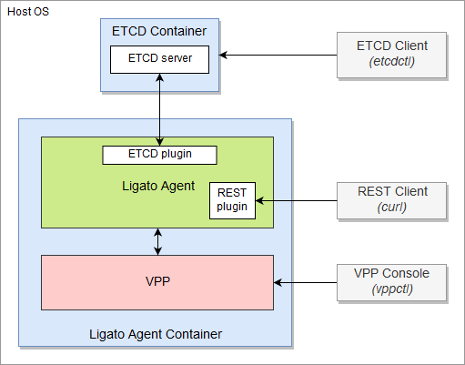

# Quickstart Guide

In this guide you will learn how to:

- Install the vpp-agent
- Install and Start etcd
- Run the vpp-agent container
- Interact with the vpp-agent using REST, CLI and etcdctl interfaces.

The figure below illustrates this quickstart guide environment.

[](https://www.draw.io/?lightbox=1&highlight=0000ff&edit=_blank&layers=1&nav=1&title=quickstart-topology.xml#Uhttps%3A%2F%2Fraw.githubusercontent.com%2Fligato%2Fdocs%2Fmaster%2Fdocs%2Fimg%2Fuser-guide%2Fquickstart-topology.xml)

!!! Note
    `VPP Agent` is used when discussing the Ligato VPP Agent in a higher level context with examples being an architecture description. `vpp-agent` is a term used to define the actual code itself and/or in describing direct interactions with other associated software components such as docker. You will see this term appear in commands, APIs and code. `VPP` is used to describe the VPP dataplane.  

---

## 1. Prerequisites

- **Docker** (Docker ce [installation manual][docker-install])
- **etcd** 
- **Postman** or **cURL** tool (postman [installation manual][postman-install])  

!!! note
    Docker ce 17.05 or higher is required.

## 2. Download the vpp-agent Image

To download the vpp-agent image from the [DockerHub][dockerhub] use the following command:
```
$ docker pull ligato/vpp-agent
```

This image contains the vpp-agent and a compatible VPP dataplane.

The command `docker images` shows us that the image exists:

```
$ docker images
REPOSITORY                  TAG                 IMAGE ID            CREATED             SIZE   
ligato/vpp-agent            latest              17b7db787662        18 hours ago        175MB
```

The `docker ps` command will not show any mention of the vpp-agent because it has not been started yet.

```
$ docker ps
CONTAINER ID        IMAGE               COMMAND             CREATED             STATUS              PORTS               NAMES
```

### 3. Start etcd

[etcd][etcd] is a key-value store that contains information about the VPP configuration. The next step is to pull down and start an etcd container.

### 3.1 Get the etcd Image

The following command starts the etcd in a docker container. If the image is not present on your local machine, docker will download it first.

```
$ docker run --rm --name etcd -p 2379:2379 -e ETCDCTL_API=3 quay.io/coreos/etcd /usr/local/bin/etcd -advertise-client-urls http://0.0.0.0:2379 -listen-client-urls http://0.0.0.0:2379
```
The CLI output will show that the etcd server is ready to accept requests from an etcd client. Open another terminal session and proceed to the next step verifying the etcd container is running:
```sh
$ docker ps -f name=etcd
CONTAINER ID        IMAGE                        COMMAND                  CREATED             STATUS              PORTS                              NAMES
f3db6e6d8975        quay.io/coreos/etcd:latest   "/usr/local/bin/etcd…"   16 minutes ago      Up 16 minutes       0.0.0.0:2379->2379/tcp, 2380/tcp   etcd
```

### 3.2 Use the etcd Client (etcdctl)

__*etcdctl*__ is the official etcd client which can be used to put/delete/get key-value pairs from the etcd store. 

You can install it locally:

```bash
// Linux users
$ apt-get install etcd-client

// MAC users
$ brew install etcd
```

However it's easier (and recommended) to use the one that comes with the etcd image:

```
$ docker exec etcd etcdctl version
etcdctl version: 3.3.8
API version: 3.3
```

!!! note
    According to the etcd documentation, the API version must be set via environmental variable: `ETCDCTL_API=3`. You can check the the value of this environment variable with the command `echo $ETCDCTL_API`. If the version is not set to "3", change it with `export ETCDCTL_API=3`.


## 4. Run the vpp-agent

This command starts the Ligato vpp-agent together with the compatible version of the VPP dataplane in a new docker container:
```
$ docker run -it --rm --name vpp-agent -p 5002:5002 -p 9191:9191 --privileged ligato/vpp-agent
``` 

Verify the vpp-agent container is running with the following command:
```
$ docker ps -f name=vpp-agent
CONTAINER ID        IMAGE               COMMAND                  CREATED             STATUS              PORTS                                            NAMES
77df69266072        ligato/vpp-agent    "/bin/sh -c 'rm -f /…"   26 seconds ago      Up 25 seconds       0.0.0.0:5002->5002/tcp, 0.0.0.0:9191->9191/tcp   vpp-agent
```
With the following command you can list all key-value pairs contained in the etcd store related to the vpp-agent:

```
$ docker exec etcd etcdctl get --prefix /vnf-agent/
```
The output should look something like this:

```
/vnf-agent/vpp1/check/status/v1/agent
{"build_version":"v2.1.1-1-g80401e6","build_date":"2019-05-27T23:57-07:00","state":"OK","start_time":"1563220274","last_change":"1563220280","last_update":"1563220475","commit_hash":"80401e66a0ef370ac61c404590de51d86f78bf4c","plugins":[{"name":"govpp","state":"OK"},{"name":"etcd","state":"OK"},{"name":"vpp-ifplugin","state":"OK"}]}
/vnf-agent/vpp1/check/status/v1/plugin/etcd
{"state":"OK","last_change":"1563220279","last_update":"1563220475"}
/vnf-agent/vpp1/check/status/v1/plugin/govpp
{"state":"OK","last_change":"1563220274","last_update":"1563220475"}
/vnf-agent/vpp1/check/status/v1/plugin/vpp-abfplugin
{"last_change":"1563220274","last_update":"1563220475"}
/vnf-agent/vpp1/check/status/v1/plugin/vpp-aclplugin
{"last_change":"1563220274","last_update":"1563220475"}
/vnf-agent/vpp1/check/status/v1/plugin/vpp-ifplugin
{"state":"OK","last_change":"1563220280","last_update":"1563220475"}
/vnf-agent/vpp1/check/status/v1/plugin/vpp-ipsec-plugin
{"last_change":"1563220274","last_update":"1563220475"}
/vnf-agent/vpp1/check/status/v1/plugin/vpp-l2plugin
{"last_change":"1563220274","last_update":"1563220475"}
/vnf-agent/vpp1/check/status/v1/plugin/vpp-l3plugin
{"last_change":"1563220274","last_update":"1563220475"}
/vnf-agent/vpp1/check/status/v1/plugin/vpp-natplugin
{"last_change":"1563220274","last_update":"1563220475"}
/vnf-agent/vpp1/check/status/v1/plugin/vpp-srplugin
{"last_change":"1563220274","last_update":"1563220475"}
```
In the next section we will program a VPP dataplane with configuration data formatted as key-value pairs. You can then run this command again and the new configuration will be displayed.

## 5. Manage the vpp-agent

This section will explain:

- How to configure the VPP dataplane through the etcd KV store and vpp-agent
- How to read VPP configuration data via a vpp-agent REST API
- How to connect to the VPP CLI and show the configuration 

### 5.1 Configure the VPP Dataplane using the vpp-agent

Configure a simple loopback interface with an IP address putting the key-value pair into the etcd store:
```
$ docker exec etcd etcdctl put /vnf-agent/vpp1/config/vpp/v2/interfaces/loop1 \
'{"name":"loop1","type":"SOFTWARE_LOOPBACK","enabled":true,"ip_addresses":["192.168.1.1/24"]}'
```
If you look closely you can see that the arguments of this etcdctl command are configuration key-value pairs for a loopback interface.

Add a bridge domain:
```
$ docker exec etcd etcdctl put /vnf-agent/vpp1/config/vpp/l2/v2/bridge-domain/bd1 \
'{"name":"bd1","forward":true,"learn":true,"interfaces":[{"name":"loop1"}]}'
```
Same idea as above, but this time for a bridge domain.

Verify the configuration is present in the etcd store:
```
$ docker exec etcd etcdctl get /vnf-agent/vpp1/config/vpp/v2/interfaces/loop1
$ docker exec etcd etcdctl get /vnf-agent/vpp1/config/vpp/l2/v2/bridge-domain/bd1
```
To summarize this first step, we used etcdctl, the etcd store and the vpp-agent (with an etcd plugin) to program loopback and bridge domain configuration data for a VPP dataplane.

Next we will use REST APIs to query the VPP dataplane configuration. 

### 5.2 Read the VPP configuration via a vpp-agent REST API

This command returns the list of VPP interfaces using a vpp-agent REST API:
```
$ curl -X GET http://localhost:9191/dump/vpp/v2/interfaces
```

Two interfaces are returned in the output:

- loopback interface with internal name `loop0` present in VPP by default
- loopback interface configured in the previous step.

The output should look something like this:

```
{
  "0": {
    "interface": {
      "type": "SOFTWARE_LOOPBACK"
    },
    "interface_meta": {
      "sw_if_index": 0,
      "sub_sw_if_index": 0,
      "l2_address": "",
      "internal_name": "local0",
      "admin_state": 0,
      "link_state": 0,
      "link_duplex": 0,
      "link_mtu": 0,
      "link_speed": 0,
      "sub_id": 0,
      "tag": "",
      "dhcp": null,
      "vrf_ipv4": 0,
      "vrf_ipv6": 0,
      "pci": 0
    }
  },
  "1": {
    "interface": {
      "name": "loop1",
      "type": "SOFTWARE_LOOPBACK",
      "enabled": true,
      "physAddress": "de:ad:00:00:00:00",
      "ipAddresses": [
        "192.168.1.1/24"
      ]
    },
    "interface_meta": {
      "sw_if_index": 1,
      "sub_sw_if_index": 1,
      "l2_address": "3q0AAAAA",
      "internal_name": "loop0",
      "admin_state": 1,
      "link_state": 1,
      "link_duplex": 0,
      "link_mtu": 9216,
      "link_speed": 0,
      "sub_id": 0,
      "tag": "loop1",
      "dhcp": null,
      "vrf_ipv4": 0,
      "vrf_ipv6": 0,
      "pci": 0
    }
  }
}
```


This command returns the bridge domain configuration information:
```
$ curl -X GET http://localhost:9191/dump/vpp/v2/bd
```
with this output:
```
[
  {
    "bridge_domain": {
      "name": "bd1",
      "forward": true,
      "learn": true,
      "interfaces": [
        {
          "name": "loop1"
        }
      ]
    },
    "bridge_domain_meta": {
      "bridge_domain_id": 1
    }
  }
]
```


URLs can be used to get the same data via postman:
```
http://localhost:9191/dump/vpp/v2/interfaces
http://localhost:9191/dump/vpp/v2/bd
```
You can view an index of the vpp-agent REST APIs using this command:
```
curl -X GET http://localhost:9191/
```
To summarize so far, we used a combination of etcdctl, the etcd store and the VPP agent to configure the VPP dataplane. Next we used REST APIs provided by the vpp-agent to read the loopback and bridge domain configuration data from the VPP dataplane.


### 5.3 Connect to the VPP Dataplane in the Container

The following command starts the VPP CLI in the vpp-agent container:
```
$ docker exec -it vpp-agent vppctl -s localhost:5002
    _______    _        _   _____  ___ 
 __/ __/ _ \  (_)__    | | / / _ \/ _ \
 _/ _// // / / / _ \   | |/ / ___/ ___/
 /_/ /____(_)_/\___/   |___/_/  /_/    

vpp# 
```

The CLI is ready to accept VPP commands. For example: 

The command `show interface` lists configured interfaces:
```
vpp# show interface
              Name               Idx    State  MTU (L3/IP4/IP6/MPLS)     Counter          Count     
local0                            0     down          0/0/0/0       
loop0                             1      up          9000/0/0/0     
```

We can see the default `local0` interface and `loop0` configured by the vpp-agent.

The command `show bridge-domain` lists configured bridge domains:
```
vpp# show bridge-domain
  BD-ID   Index   BSN  Age(min)  Learning  U-Forwrd   UU-Flood   Flooding  ARP-Term   BVI-Intf 
    1       1      0     off        on        on        drop       off       off        N/A    
```

As an alternative, you can run the commands directly from the terminal CLI like so:
```
$ docker exec -it vpp-agent vppctl -s localhost:5002 show interface
$ docker exec -it vpp-agent vppctl -s localhost:5002 show interface addr
$ docker exec -it vpp-agent vppctl -s localhost:5002 show bridge-domain
```

## Troubleshooting

The vpp-agent container was started and immediately closed.
  
- The etcd container is not running. Please verify it is running using command `docker ps`.

The etcdctl command returns "Error:  100: Key not found".

- The etcdctl API version was not correctly set. Check the output of the appropriate environment variable with command `echo $ETCDCTL_API`. If the version is not set to "3", change it with `export ETCDCTL_API=3`.


The cURL or Postman command to access vpp-agent API does not work (connection refused).

- The command starting the docker container exports port 9191 to allow access from the host. Make sure that the vpp-agent docker container is started with parameter `-p 9191:9191`. Run the `Restart vpp-agent steps`   shown below to modify port numbers. 


The cURL or Postman command to access VPP-cli does not work (connection refused)

- The command starting docker container exports port 5002 (the VPP default port) to allow access from the host. Make sure that the vpp-agent docker container is started with parameter `-p 5002:5002`. Run the `Restart vpp-agent steps` shown below to modify port numbers.

Restart vpp-agent steps:

    docker ps -f name=vpp-agent
    docker stop <XX> ; with <XX> equals first to 2 characters of container ID
    // restart with correct port numbers if needed
    docker run -it --rm --name vpp-agent -p 5002:5002 -p 9191:9191 --privileged ligato/vpp-agent
    
<br/>


[docker-install]: https://docs.docker.com/cs-engine/1.13/
[dockerhub]: https://hub.docker.com/u/ligato
[postman-install]: https://learning.getpostman.com/docs/postman/launching_postman/installation_and_updates/
[etcd]: https://etcd.io/

*[CLI]: Command-Line Interface
*[REST]: Representational State Transfer
