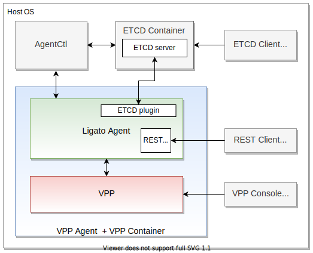

# Quickstart Guide

---

This section provides a quickstart guide for the VPP agent. You will learn how to:

- Install and start the VPP agent container.
- Manage the VPP agent using CLI tools and REST APIs.

--- 

## Environment and steps

The figure below illustrates your quickstart guide environment.


<p style="margin: 0px 0px 24px 150px; font-weight: bold">Quickstart Guide Environment</p>
 
---


**Steps**

List of steps to follow for the quickstart:

1. Prerequsites
<br></br>
2. Download VPP agent docker image
<br></br>
3. Download/install etcd docker image
<br></br>
4. Start the VPP agent container
<br></br>
5. Manage the VPP agent with etcdctl, REST, VPP CLI, and agentctl.

---

## 1. Prerequisites

List of prerequisites to run the quickstart:

- Laptop or local machine running macOS or linux.
<br></br>
- Docker software - (Docker ce [installation manual][docker-install])
<br></br>
- Ability to execute docker commands:
```
docker pull
docker ps
docker run
docker exec
``` 
- Ability to run CLI and cURL commands. 

!!! Note
    The steps described in this quickstart guide use Docker 19.03.5. Use the `docker --version` command to check your version. 

---

## 2. Download image

Open a new terminal session. Pull the VPP agent image from [DockerHub][dockerhub]. This image contains the VPP agent and a compatible VPP data plane. 

```
docker pull ligato/vpp-agent
```


Verify the image download:

```
docker images
```

Sample output:
```
REPOSITORY              TAG                 IMAGE ID            CREATED             SIZE
ligato/vpp-agent        latest              05ad16109a2b        3 days ago          264MB
```


---

## 3. etcd

[etcd][etcd] is a key-value (KV) data store containing VPP configuration information structured as key-value pairs. 

### 3.1 Start etcd

Open a new terminal session. Start the etcd server in a docker container. If you don't have etcd on your localhost, docker downloads it for you. Note `etcd` is the name of the docker container.
```
docker run --rm --name etcd -p 2379:2379 -e ETCDCTL_API=3 quay.io/coreos/etcd /usr/local/bin/etcd -advertise-client-urls http://0.0.0.0:2379 -listen-client-urls http://0.0.0.0:2379
```

You will see a scrolling etcd log.  

Open a new terminal session and verify you have a running `etcd` container:
```sh
docker ps -f name=etcd
```
Sample output:
```
CONTAINER ID        IMAGE                        COMMAND                  CREATED             STATUS              PORTS                              NAMES
f3db6e6d8975        quay.io/coreos/etcd:latest   "/usr/local/bin/etcd…"   16 minutes ago      Up 16 minutes       0.0.0.0:2379->2379/tcp, 2380/tcp   etcd
```

---

### 3.2 etcdctl

**etcdctl** is an etcd client CLI tool. You can list, put, delete and get key-value pairs from the etcd data store.

You will use the etcdctl version that comes along with the etcd. This keeps things simple. 

Check the version of etcdctl you are running:
```
docker exec -it etcd etcdctl version
```
Sample output:
```
etcdctl version: 3.3.8
API version: 3.3
```
Verify etcd server endpoint health:
```json
docker exec -it etcd etcdctl endpoint health
```
Sample output:
```json
127.0.0.1:2379 is healthy: successfully committed proposal: took = 1.6141ms
```

Alternatively, you can install etcdctl on your laptop or local machine. 
```bash
// Linux users
$ apt-get install etcd-client

// MAC users
$ brew install etcd
```

As this point, you have installed and started your etcd container, and etcdctl is ready to go.

---

## 4. Start VPP agent

Open a new terminal session. Start the VPP agent in a new docker container. Note `vpp-agent` is the name of the docker container. 
```
docker run -it --rm --name vpp-agent -p 5002:5002 -p 9191:9191 --privileged ligato/vpp-agent
``` 

You will see the scrolling VPP agent log. Look this over as you put and delete configuration items. The log comes in handy when you need to observe and troubleshoot VPP agent activities.

Open a new terminal session. Verify you have a running `vpp-agent` container:

```
docker ps -f name=vpp-agent
```

Sample output:
```
CONTAINER ID        IMAGE               COMMAND                  CREATED             STATUS              PORTS                                            NAMES
66556668533d        ligato/vpp-agent    "/bin/sh -c 'rm -f /…"   19 seconds ago      Up 19 seconds       0.0.0.0:5002->5002/tcp, 0.0.0.0:9191->9191/tcp   vpp-agent
```

Now you have the etcd and VPP agent containers running and ready to use. 

---

## 5. Managing the VPP agent

You can interact with the VPP agent using the following:
 
- [etcdctl](#51-etcdctl)
<br></br>
- [REST API](#52-rest-api)
<br></br>
- [VPP CLI](#53-vpp-cli)
<br></br>
- [Agentctl](#54-agentctl)

!!! Note
    Northbound (NB) refers to the communication between external clients and a VPP agent. You manage the __desired VPP agent configuration__ across the __NB__.<br></br>Southbound (SB) refers to the communication between the VPP agent and VPP data plane. VPP data plane events, notifications and __runtime VPP configuration__ dumps occur across the __SB__.
 


---

### 5.1 etcdctl

etcdctl lets you put and get NB configuration data between an etcd data store and the VPP agent.

!!! Note
    If you prefer to use REST to manage VPP agent configuration data, skip this sub-section and go to [5.2](#52-rest-api) **VPP agent NB configuration** below. 

---

VPP agent entries contained in the etcd data store use a prefix of `/vnf-agent/`. 

List key-value pairs with the  `/vnf-agent/` prefix:
```
docker exec -it etcd etcdctl get --prefix /vnf-agent/
```
Sample output:
```
/vnf-agent/vpp1/check/status/v1/agent
{"build_version":"v2.1.1-1-g80401e6","build_date":"2019-05-27T23:57-07:00","state":"OK","start_time":"1563220274","last_change":"1563220280","last_update":"1563220475","commit_hash":"80401e66a0ef370ac61c404590de51d86f78bf4c","plugins":[{"name":"govpp","state":"OK"},{"name":"etcd","state":"OK"},{"name":"vpp-ifplugin","state":"OK"}]}
/vnf-agent/vpp1/check/status/v1/plugin/etcd
{"state":"OK","last_change":"1563220279","last_update":"1563220475"}
/vnf-agent/vpp1/check/status/v1/plugin/govpp
{"state":"OK","last_change":"1563220274","last_update":"1563220475"}
/vnf-agent/vpp1/check/status/v1/plugin/vpp-abfplugin
{"last_change":"1563220274","last_update":"1563220475"}
/vnf-agent/vpp1/check/status/v1/plugin/vpp-aclplugin
{"last_change":"1563220274","last_update":"1563220475"}
/vnf-agent/vpp1/check/status/v1/plugin/vpp-ifplugin
{"state":"OK","last_change":"1563220280","last_update":"1563220475"}
/vnf-agent/vpp1/check/status/v1/plugin/vpp-ipsec-plugin
{"last_change":"1563220274","last_update":"1563220475"}
/vnf-agent/vpp1/check/status/v1/plugin/vpp-l2plugin
{"last_change":"1563220274","last_update":"1563220475"}
/vnf-agent/vpp1/check/status/v1/plugin/vpp-l3plugin
{"last_change":"1563220274","last_update":"1563220475"}
/vnf-agent/vpp1/check/status/v1/plugin/vpp-natplugin
{"last_change":"1563220274","last_update":"1563220475"}
/vnf-agent/vpp1/check/status/v1/plugin/vpp-srplugin
{"last_change":"1563220274","last_update":"1563220475"}
```

---

Configure a **loopback interface** with an IP address. Put the key-value pairs to the etcd data store:
```
docker exec etcd etcdctl put /vnf-agent/vpp1/config/vpp/v2/interfaces/loop1 \
'{"name":"loop1","type":"SOFTWARE_LOOPBACK","enabled":true,"ip_addresses":["192.168.1.1/24"]}'
```
Note the key-value pairs put to the etcd data store contain your loopback interface configuration.

---

Configure a **bridge domain**:
```
docker exec etcd etcdctl put /vnf-agent/vpp1/config/vpp/l2/v2/bridge-domain/bd1 \
'{"name":"bd1","forward":true,"learn":true,"interfaces":[{"name":"loop1"}]}'
```
Same idea as above, but this time for a bridge domain.

---

Verify the **loopback interface** configuration exists in the etcd data store:
```
docker exec etcd etcdctl get /vnf-agent/vpp1/config/vpp/v2/interfaces/loop1
```

Sample output:
```
/vnf-agent/vpp1/config/vpp/v2/interfaces/loop1
{"name":"loop1","type":"SOFTWARE_LOOPBACK","enabled":true,"ip_addresses":["192.168.1.1/24"]}
```

---

Verify the **bridge domain configuration** exists in the etcd data store:
```
docker exec etcd etcdctl get /vnf-agent/vpp1/config/vpp/l2/v2/bridge-domain/bd1
```
Sample output:
```
/vnf-agent/vpp1/config/vpp/l2/v2/bridge-domain/bd1
{"name":"bd1","forward":true,"learn":true,"interfaces":[{"name":"loop1"}]}
```

---

### 5.2 REST API
 
REST supports VPP agent NB configuration management and SB VPP configuration dumps. 

---

#### VPP agent NB configuration

To configure the VPP agent across the NB using REST, you must define the configuration in a yaml file. 

Sample `loop-bd.yaml` file containing a **loopback interface** and **bridge domain configuration**:
```
vppConfig:
  interfaces:
  - name: "loop1"
    type: SOFTWARE_LOOPBACK
    enabled: true
    ipAddresses:
    - 192.168.1.1/24
  bridgeDomains:
    - name: bd1
      forward: true
      learn: true
      interfaces:
        - name: loop1
```

---

Configure the VPP agent with the NB configuration defined in `loop-bd.yaml`:
```
curl -X PUT -H "Content-Type: application/yaml" --data-binary @loop-bd.yaml http://localhost:9191/configuration
```
---

Get the VPP agent configuration:
```
curl -X GET http://localhost:9191/configuration
```
Sample response:
```
netallocConfig: {}
linuxConfig: {}
vppConfig:
  interfaces:
  - name: loop1
    type: SOFTWARE_LOOPBACK
    enabled: true
    ipAddresses:
    - 192.168.1.1/24
  bridgeDomains:
  - name: bd1
    forward: true
    learn: true
    interfaces:
    - name: loop1
```


---

#### Dump runtime VPP configuration

You can dump the runtime VPP configuration using GET /dump/vpp/ REST calls. 

!!! Note
    You can run GET /dump/vpp/ REST API calls independent of the VPP agent NB configuration method your application employs. 

---

Call [GET /dump/vpp/v2/interfaces](../api/api-vpp-agent.md#vpp-interfaces) to dump all VPP data plane interface configuration data:
```
curl -X GET http://localhost:9191/dump/vpp/v2/interfaces
```

The response describes two interfaces:

- loopback interface `"name": "UNTAGGED-local0"` present in VPP by default
- loopback interface `"name": "loop1"`configured in the previous step.

Sample response:

```
{
  "0": {
    "interface": {
      "name": "UNTAGGED-local0",
      "type": "SOFTWARE_LOOPBACK",
      "physAddress": "00:00:00:00:00:00"
    },
    "interface_meta": {
      "sw_if_index": 0,
      "sub_sw_if_index": 0,
      "l2_address": "AAAAAAAA",
      "internal_name": "local0",
      "is_admin_state_up": false,
      "is_link_state_up": false,
      "link_duplex": 0,
      "link_mtu": 0,
      "mtu": [
        0,
        0,
        0,
        0
      ],
      "link_speed": 0,
      "sub_id": 0,
      "tag": "",
      "dhcp": null,
      "vrf_ipv4": 0,
      "vrf_ipv6": 0,
      "pci": 0
    }
  },
  "1": {
    "interface": {
      "name": "loop1",
      "type": "SOFTWARE_LOOPBACK",
      "enabled": true,
      "physAddress": "de:ad:00:00:00:00",
      "ipAddresses": [
        "192.168.1.1/24"
      ]
    },
    "interface_meta": {
      "sw_if_index": 1,
      "sub_sw_if_index": 1,
      "l2_address": "3q0AAAAA",
      "internal_name": "loop0",
      "is_admin_state_up": true,
      "is_link_state_up": true,
      "link_duplex": 0,
      "link_mtu": 9216,
      "mtu": [
        9000,
        0,
        0,
        0
      ],
      "link_speed": 0,
      "sub_id": 0,
      "tag": "loop1",
      "dhcp": null,
      "vrf_ipv4": 0,
      "vrf_ipv6": 0,
      "pci": 0
    }
  }
}
```

---

Call [GET /dump/vpp/v2/bd](../api/api-vpp-agent.md#vpp-l2-bridge-domain) to dump bridge domain configuration information:
```
curl -X GET http://localhost:9191/dump/vpp/v2/bd
```
Sample response:
```
[
  {
    "bridge_domain": {
      "name": "bd1",
      "forward": true,
      "learn": true,
      "interfaces": [
        {
          "name": "loop1"
        }
      ]
    },
    "bridge_domain_meta": {
      "bridge_domain_id": 1
    }
  }
]

```


For more information on VPP agent REST APIs including sample responses, see [VPP Agent API Docs](../api/api-vpp-agent.md). 


---

### 5.3 VPP CLI

Start the VPP CLI in the `vpp-agent` container you set up in the steps above.
```
docker exec -it vpp-agent vppctl -s localhost:5002
```
output:
```
    _______    _        _   _____  ___ 
 __/ __/ _ \  (_)__    | | / / _ \/ _ \
 _/ _// // / / / _ \   | |/ / ___/ ___/
 /_/ /____(_)_/\___/   |___/_/  /_/    

vpp# 
```

List configured interfaces:
```
vpp# show interface
```
Sample output:
```
              Name               Idx    State  MTU (L3/IP4/IP6/MPLS)     Counter          Count
local0                            0     down          0/0/0/0
loop0                             1      up          9000/0/0/0
```

The VPP agent automatically creates the default `local0` interface.  You configured the `loop0` interface in [section 5.1](#51-etcdctl). 


---

Show bridge domains:
```
vpp# show bridge-domain
```
 Sample output:
```
 BD-ID   Index   BSN  Age(min)  Learning  U-Forwrd   UU-Flood   Flooding  ARP-Term  arp-ufwd   BVI-Intf
    1       1      0     off        on        on        drop       off       off       off        N/A
```

Help for VPP CLI commands options:
```
vpp# help
```

---

You can run VPP CLI commands directly from a terminal session command line.
```
docker exec -it vpp-agent vppctl -s localhost:5002 show interface
docker exec -it vpp-agent vppctl -s localhost:5002 show interface addr
docker exec -it vpp-agent vppctl -s localhost:5002 show bridge-domain
```

You can run VPP CLI commands using REST. To view the syntax with an example, see [VPP CLI REST](../api/api-vpp-agent.md#vpp-cli-command) 

---

Use the `quit` command to exit the VPP CLI.

For more information on VPP CLI commands, see the [CLI guide on the FD.io wiki](https://wiki.fd.io/view/VPP/Command-line_Interface_(CLI)_Guide), and [VPP CLI](vpp-cli.md).

---

### 5.4 Agentctl

Agenctl is a CLI command line tool for managing and interacting with the software components of the Ligato framework.

Agentctl help:
```
docker exec -it vpp-agent agentctl --help
```
Output:
```

                      __      __  __
  ___ ____ ____ ___  / /_____/ /_/ /
 / _ '/ _ '/ -_) _ \/ __/ __/ __/ /
 \_,_/\_, /\__/_//_/\__/\__/\__/_/
     /___/

COMMANDS
  config      Manage agent configuration
  dump        Dump running state
  generate    Generate config samples
  import      Import config data from file
  kvdb        Manage agent data in KVDB
  log         Manage agent logging
  metrics     Get runtime metrics
  model       Manage known models
  report      Create error report
  service     Manage agent services
  status      Retrieve agent status and version info
  values      Retrieve values from scheduler
  vpp         Manage VPP instance

OPTIONS:
      --config-dir string        Path to directory with config file.
  -D, --debug                    Enable debug mode
  -e, --etcd-endpoints strings   Etcd endpoints to connect to, default from ETCD_ENDPOINTS env var (default
                                 [127.0.0.1:2379])
      --grpc-port int            gRPC server port (default 9111)
  -H, --host string              Address on which agent is reachable, default from AGENT_HOST env var (default "127.0.0.1")
      --http-basic-auth string   Basic auth for HTTP connection in form "user:pass"
      --http-port int            HTTP server port (default 9191)
      --insecure-tls             Use TLS without server's certificate validation
  -l, --log-level string         Set the logging level ("debug"|"info"|"warn"|"error"|"fatal")
      --service-label string     Service label for specific agent instance, default from MICROSERVICE_LABEL env var
  -v, --version                  Print version info and quit

Run 'agentctl COMMAND --help' for more information on a command.
```

Get VPP agent NB configuration:
```json
docker exec -it vpp-agent agentctl config get
```
Sample output:
```json
vppConfig:
  interfaces:
  - name: loop1
    type: SOFTWARE_LOOPBACK
    enabled: true
    ipAddresses:
    - 192.168.1.1/24
  bridgeDomains:
  - name: bd1
    forward: true
    learn: true
    interfaces:
    - name: loop1
linuxConfig: {}
netallocConfig: {}
```

Note this command produces the same output as the `GET /localhost:9191/configuration` REST API you called above.

---

Dump runtime VPP configuration:
```
docker exec -it vpp-agent agentctl -e 172.17.0.2:2379 config retrieve
```
Sample output (partial):
```
vppConfig:
  interfaces:
  - name: UNTAGGED-local0
    type: SOFTWARE_LOOPBACK
    physAddress: 00:00:00:00:00:00
  - name: loop1
    type: SOFTWARE_LOOPBACK
    enabled: true
    physAddress: de:ad:00:00:00:00
    ipAddresses:
    - 192.168.1.1/24
  bridgeDomains:
  - name: bd1
    forward: true
    learn: true
    interfaces:
    - name: loop1
```

Note that the yaml-formatted partial output includes a VPP interface `phyAddress`. If you do not assign an interface mac address, Ligato generates a random mac address.   

---

To learn more about `agentctl config` commands, see [agentctl config](agentctl.md#config).
 

---

## Troubleshooting

**VPP agent container starts and immediately closes**
  
- Check the [start etcd steps](#31-start-etcd). You must have a running etcd container to work with the quickstart configuration. 

---

**etcdctl command returns "Error:  100: Key not found"**

- You might need to set the etcdctl API version. Check the output of `echo $ETCDCTL_API`. You must set the value to "3". You can change it with the `export ETCDCTL_API=3` environment variable. See [etcdctl](#32-etcdctl) for more details.

---

**VPP agent REST API does not work** (connection refused).

- The [VPP agent start](#4-start-vpp-agent) command exports port 9191 for host access. Make sure the VPP agent docker container starts with parameter `-p 9191:9191`. You can change this to a different port number by setting the `-p` flag when you start the VPP agent container. See _Restart the VPP agent container_ below.

---

**VPP agent REST API for VPP CLI does not work** (connection refused)

- The [VPP agent start](#4-start-vpp-agent) command exports port 5002 for VPP CLI access. Make sure the VPP agent docker container starts with parameter `-p 5002:5002`. You can change this by setting the `-p` flag when you start the VPP agent container. See _Restart the VPP agent container_ below.

---

Agentctl kvdb `ERROR: connecting to KVDB failed` problem.

- Agentctl uses `127.0.0.1:2379` as the etcd server address. However, in the examples above, the etcd data store runs in a separate container. To resolve:

Obtain the IP address of the etcd server:
```json
docker inspect -f '{{range .NetworkSettings.Networks}}{{.IPAddress}}{{end}}' etcd
``` 
Output:
```json
172.17.0.2
```
Then pass this address to agentctl using the `-e` or `--etcd-endpoints` flag:
```json
docker exec -it vpp-agent agentctl -e 172.17.0.2:2379 kvdb <COMMAND>
```

---

**Restart the VPP agent container**

1. You need to obtain the CONTAINER ID of the VPP agent.
```
docker ps -f name=vpp-agent
```
2. Stop the VPP agent container:
```
docker stop <XX> ; with <XX> equals first to 2 characters of CONTAINER ID from the docker ps command
```
3. Restart the VPP agent container with different port numbers:
```
docker run -it --rm --name vpp-agent -p 5002:5002 -p 9191:9191 --privileged ligato/vpp-agent
```
    

[docker-install]: https://docs.docker.com/cs-engine/1.13/
[dockerhub]: https://hub.docker.com/u/ligato
[postman-install]: https://learning.getpostman.com/docs/postman/launching_postman/installation_and_updates/
[etcd]: https://etcd.io/

*[CLI]: Command-Line Interface
*[REST]: Representational State Transfer
